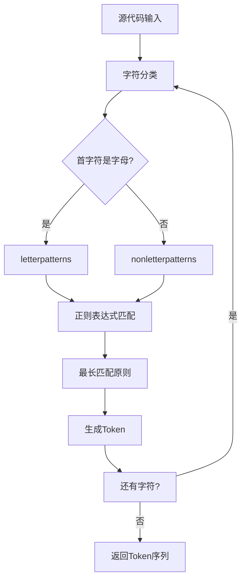

# Rx 语言编译器 Lexer 文档

## 概述

Lexer（词法分析器）是 Rx 语言编译器的第一个阶段，负责将源代码文本转换为一系列的 token（词法单元）。

## 整体架构

### 文件结构
- [`include/lexer.hpp`](../../include/lexer.hpp) - Lexer 类定义和 Token 枚举
- [`src/lexer.cpp`](../../src/lexer.cpp) - Lexer 类实现
- [`tests/lexer_test.cpp`](../../tests/lexer_test.cpp) - Lexer 单元测试

### 核心组件

1. **Token 枚举** - 定义了所有支持的词法单元类型
2. **Lexer 类** - 主要的词法分析器实现
3. **正则表达式模式** - 用于识别不同类型的 token
4. **字符串处理方法** - 处理输入源代码

## 工作流程

Lexer 的工作流程可以概括为以下步骤：

1. **输入预处理** - 接收源代码字符串
2. **字符分类** - 根据首字符选择匹配模式
3. **模式匹配** - 使用正则表达式进行最长匹配
4. **Token 生成** - 将匹配的字符串转换为 token
5. **输出结果** - 返回 token 序列给 Parser



## 技术特点

### 1. 基于正则表达式的模式匹配
Lexer 使用 Boost 正则表达式库进行模式匹配。

### 2. 最长匹配原则
当多个模式都能匹配当前输入时，选择匹配长度最长的模式。

### 3. 字符分类
根据首字符（字母或非字母）选择不同的模式集合。

### 4. 注释处理
特殊处理单行注释（`//`）和多行注释（`/* */`）。

## 与其他组件的交互

### 与 Parser 的交互
Lexer 的主要输出是 `std::vector<std::pair<Token, std::string>>`，这个数据结构被 Parser 直接使用：

```cpp
// Parser 构造函数接收 Lexer 的输出
Parser(std::vector<std::pair<Token, std::string>> tokens);

// Parser 中的核心方法
Token peek();           // 查看当前 token
bool match(Token token); // 匹配特定 token
void advance();         // 前进到下一个 token
std::string getstring(); // 获取当前 token 的字符串值
```

### 在编译器链中的位置
```
源代码 → Lexer → Parser → Semantic Analysis → Code Generation
```

## 支持的语言特性

### 1. 关键字和保留字
- Rust 风格的关键字：`fn`, `let`, `if`, `else`, `while`, `for` 等
- 保留关键字：`abstract`, `become`, `box`, `do` 等

### 2. 字面量
- 整数字面量（支持不同进制）
- 字符和字符串字面量
- 原始字符串字面量
- 字节字面量和字节字符串
- C 字符串字面量

### 3. 运算符
- 算术运算符：`+`, `-`, `*`, `/`, `%`
- 比较运算符：`==`, `!=`, `<`, `>`, `<=`, `>=`
- 逻辑运算符：`&&`, `||`, `!`
- 位运算符：`&`, `|`, `^`, `~`, `<<`, `>>`
- 赋值运算符：`=`, `+=`, `-=`, `*=`, `/=` 等

### 4. 分隔符和标点
- 括号：`(`, `)`, `{`, `}`, `[`, `]`
- 其他标点：`,`, `;`, `:`, `::`, `->`, `=>` 等

## 错误处理

Lexer 采用宽松的错误处理策略：
- 对于无法匹配的输入，会跳过或进行部分匹配
- 注释处理具有容错性
- 支持错误恢复机制

## 测试覆盖

Lexer 包含全面的单元测试，覆盖：
- 各种字面量类型
- 所有关键字和运算符
- 边界情况和错误恢复
- 复杂表达式的词法分析

---

*本文档基于 Rx 语言编译器的实际实现编写，所有分析以源代码为准。*