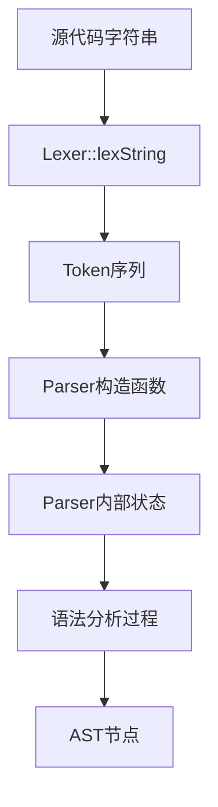

# Lexer 与其他组件的交互接口详细分析

## 概述

Lexer 作为 Rx 语言编译器的第一个阶段，与多个组件存在重要的交互关系。

## 核心数据结构

### Token 序列类型

```cpp
std::vector<std::pair<Token, std::string>>
```

**结构分析**：
- **外层容器**：`std::vector` 提供随机访问和动态大小
- **元素类型**：`std::pair<Token, std::string>` 包含两个部分
  - `Token`：词法单元的枚举类型
  - `std::string`：原始文本内容

## 与 Parser 的交互

### 1. 接口定义

```cpp
// Parser 构造函数
Parser(std::vector<std::pair<Token, std::string>> tokens);

// Lexer 的输出方法
std::vector<std::pair<Token, std::string>> lexString(std::string s);
```

### 2. 数据流分析



### 3. Parser 内部的 Token 处理

```cpp
class Parser {
private:
    std::vector<std::pair<Token, std::string>> tokens;
    size_t pos = 0;

public:
    Token peek();
    bool match(Token token);
    void advance();
    std::string getstring();
};
```

#### 详细实现分析

**peek() 方法**：
```cpp
Token Parser::peek() {
    if (pos < tokens.size()) {
        return tokens[pos].first;
    }
    return Token::kEnd;
}
```

**match() 方法**：
```cpp
bool Parser::match(Token token) {
    if (peek() == token) {
        advance();
        return true;
    }
    return false;
}
```

**advance() 方法**：
```cpp
void Parser::advance() {
    if (pos < tokens.size()) {
        pos++;
    }
}
```

**getstring() 方法**：
```cpp
std::string Parser::getstring() {
    if (pos < tokens.size()) {
        return tokens[pos].second;
    }
    return "";
}
```

### 4. 运算符优先级处理

```cpp
int getLeftTokenBP(Token token) {
    switch (token) {
        case Token::kDot: return PATH_ACCESS;
        case Token::kleftParenthe:
        case Token::kleftSquare: return CALL_INDEX;
        case Token::kStar:
        case Token::kSlash:
        case Token::kPercent: return MULT_DIV_MOD;
        default: return -1;
    }
}
```

## 与测试框架的交互

### 1. 单元测试接口

```cpp
class LexserTest : public ::testing::Test {
protected:
    Lexer lexer;
};
```

### 2. 测试用例模式

#### 基本测试模式
```cpp
TEST_F(LexserTest, SimpleIdentifier) {
    std::string input = "x";
    auto result = lexer.lexString(input);
    
    ASSERT_EQ(result.size(), 1);
    EXPECT_EQ(result[0].first, Token::kIDENTIFIER);
    EXPECT_EQ(result[0].second, "x");
}
```

#### 复杂测试模式
```cpp
TEST_F(LexserTest, ComplexExpression) {
    std::string input = "fn add(a: i32, b: i32) -> i32 { return a + b * 2; }";
    auto result = lexer.lexString(input);
    
    ASSERT_EQ(result.size(), 22);
    EXPECT_EQ(result[0].first, Token::kfn);
    EXPECT_EQ(result[1].first, Token::kIDENTIFIER);
    EXPECT_EQ(result[1].second, "add");
}
```

### 3. 错误处理测试

```cpp
TEST_F(LexserTest, InvalidNumberLiterals) {
    std::string input = "0b123 0o79 123abc";
    auto result = lexer.lexString(input);
    
    ASSERT_EQ(result.size(), 6);
    EXPECT_EQ(result[0].first, Token::kINTEGER_LITERAL);
    EXPECT_EQ(result[0].second, "0b1");
}
```

## 与编译器主程序的集成

### 1. 典型使用模式

```cpp
int main() {
    Lexer lexer;
    
    // 1. 获取输入源
    std::string source = lexer.GetString();
    
    // 2. 词法分析
    auto tokens = lexer.lexString(source);
    
    // 3. 语法分析
    Parser parser(tokens);
    auto ast = parser.parseCrate();
    
    // 4. 后续处理...
    
    return 0;
}
```

### 2. 错误处理集成

```cpp
try {
    Lexer lexer;
    std::string source = lexer.GetString();
    auto tokens = lexer.lexString(source);
    
    if (tokens.empty()) {
        std::cerr << "Warning: No tokens generated from input" << std::endl;
    }
    
    Parser parser(tokens);
    auto ast = parser.parseCrate();
    
} catch (const std::exception& e) {
    std::cerr << "Error: " << e.what() << std::endl;
    return 1;
}
```

## 与可视化组件的交互

### 1. AST 可视化支持

```cpp
// 在 AST 可视化中可能需要显示原始 Token 信息
class ASTVisualizer {
public:
    void visualizeToken(const std::pair<Token, std::string>& token) {
        std::cout << to_string(token.first) << ": " << token.second << std::endl;
    }
};
```

### 2. 调试信息输出

```cpp
class Lexer {
public:
    std::vector<std::pair<Token, std::string>> lexString(std::string s, bool debug = false) {
        auto result = lexStringImpl(s);
        
        if (debug) {
            for (size_t i = 0; i < result.size(); i++) {
                std::cerr << i << ": " << to_string(result[i].first)
                         << " '" << result[i].second << "'" << std::endl;
            }
        }
        
        return result;
    }
};
```

## 与语义分析组件的间接交互

### 1. 符号表构建

```cpp
// 标识符信息用于符号表
class SymbolTable {
public:
    void addIdentifier(const std::string& name, const Token& token) {
        symbols[name] = {token, /* 其他信息 */};
    }
};
```

### 2. 类型检查支持

```cpp
class TypeChecker {
public:
    bool isTypeToken(const Token& token) {
        return token == Token::kIDENTIFIER ||
               token == Token::ki32 ||
               token == Token::ku32;
    }
};
```

## 性能考虑

### 1. 内存管理

#### Token 序列的内存布局
```cpp
// 优化前的内存布局（分散）
std::vector<std::pair<Token, std::string>> tokens;
// 每个 string 可能在不同内存位置

// 优化建议：字符串池
class StringPool {
private:
    std::vector<char> data;
    std::unordered_map<std::string, size_t> index;
    
public:
    size_t intern(const std::string& str) {
        auto it = index.find(str);
        if (it != index.end()) {
            return it->second;
        }
        
        size_t offset = data.size();
        data.insert(data.end(), str.begin(), str.end());
        data.push_back('\0');
        index[str] = offset;
        return offset;
    }
};
```

### 2. 流式处理支持

```cpp
class StreamingLexer {
public:
    class TokenStream {
    public:
        std::pair<Token, std::string> next() {
            // 返回下一个 token
        }
        
        bool hasNext() const {
            // 检查是否还有 token
        }
    };
    
    TokenStream tokenize(std::istream& input);
};
```

## 扩展性设计

### 1. 插件化架构

```cpp
class LexerPlugin {
public:
    virtual ~LexerPlugin() = default;
    virtual std::vector<std::pair<Token, std::string>>
        process(const std::string& input) = 0;
};

class ExtensibleLexer : public Lexer {
private:
    std::vector<std::unique_ptr<LexerPlugin>> plugins;
    
public:
    void addPlugin(std::unique_ptr<LexerPlugin> plugin) {
        plugins.push_back(std::move(plugin));
    }
};
```

### 2. 配置化支持

```cpp
struct LexerConfig {
    bool enableComments = true;
    bool preserveWhitespace = false;
    std::unordered_set<std::string> customKeywords;
};

class ConfigurableLexer : public Lexer {
public:
    std::vector<std::pair<Token, std::string>>
        lexString(const std::string& s, const LexerConfig& config = {});
};
```

## 错误处理和恢复

### 1. 错误信息结构

```cpp
struct LexError {
    size_t position;
    size_t line;
    size_t column;
    std::string message;
    std::string context;
};

class ErrorReportingLexer : public Lexer {
private:
    std::vector<LexError> errors;
    
public:
    const std::vector<LexError>& getErrors() const { return errors; }
    
    std::vector<std::pair<Token, std::string>> 
        lexString(const std::string& s) override;
};
```

### 2. 恢复策略

```cpp
enum class RecoveryStrategy {
    SKIP,           // 跳过错误字符
    INSERT,         // 插入期望的 token
    REPLACE,        // 替换为相似 token
    PANIC           // 停止解析
};
```

## 与其他语言的集成

### 1. C 接口

```cpp
extern "C" {
    struct TokenList {
        const char* types;
        const char* values;
        size_t count;
    };
    
    TokenList* lexer_tokenize(const char* input);
    void lexer_free(TokenList* tokens);
}
```

### 2. Python 绑定

```cpp
// 使用 pybind11
#include <pybind11/pybind11.h>
#include <pybind11/stl.h>

PYBIND11_MODULE(lexer_py, m) {
    py::class_<Lexer>(m, "Lexer")
        .def(py::init<>())
        .def("lex_string", &Lexer::lexString);
}
```

## 最佳实践建议

### 1. 接口设计原则

- **单一职责**：Lexer 只负责词法分析
- **最小依赖**：减少对外部组件的依赖
- **类型安全**：使用强类型接口
- **错误透明**：提供清晰的错误信息

### 2. 性能优化

- **批量处理**：避免频繁的小操作
- **内存局部性**：优化数据布局
- **缓存友好**：减少随机访问
- **延迟计算**：按需生成复杂信息

### 3. 可维护性

- **清晰命名**：使用描述性的名称
- **文档完整**：提供详细的接口文档
- **测试覆盖**：确保所有接口都有测试
- **版本兼容**：保持接口的向后兼容性

---

*此分析基于 Rx 语言编译器的实际实现，所有代码片段均来自源文件或基于实际架构的合理扩展。*