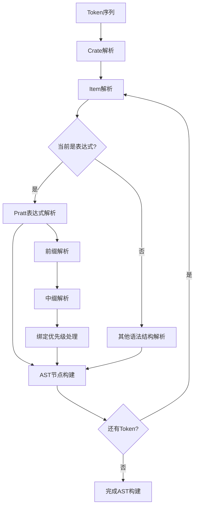

# Rx 语言编译器 Parser 文档

## 概述

Parser（语法分析器）是 Rx 语言编译器的第二个阶段，负责将 Lexer 输出的 token 序列转换为抽象语法树（AST）。Rx 编译器采用 Pratt 解析器（也称为 Top-Down Operator Precedence Parsing）来处理复杂的表达式语法和运算符优先级。

## 整体架构

### 文件结构
- [`include/parser.hpp`](../../include/parser.hpp) - Parser 类定义和绑定优先级枚举
- [`src/parser.cpp`](../../src/parser.cpp) - Parser 类实现
- [`include/astnodes.hpp`](../../include/astnodes.hpp) - AST 节点定义
- [`tests/parser_test.cpp`](../../tests/parser_test.cpp) - Parser 单元测试

### 核心组件

1. **Pratt 解析器引擎** - 基于绑定优先级的表达式解析
2. **绑定优先级系统** - 定义运算符的优先级和结合性
3. **Token 管理器** - 处理 token 序列的遍历和访问
4. **AST 构建器** - 构建各种类型的语法树节点
5. **语法规则解析器** - 处理语句、项、模式、类型等语法结构

## 工作流程

Parser 的工作流程可以概括为以下步骤：

1. **Token 序列输入** - 接收 Lexer 输出的 token 序列
2. **顶层解析** - 从 Crate 开始解析整个源文件
3. **项解析** - 解析函数、结构体、枚举等顶级项
4. **表达式解析** - 使用 Pratt 算法解析复杂表达式
5. **AST 构建** - 构建完整的抽象语法树
6. **输出结果** - 返回 AST 给语义分析器



## 技术特点

### 1. Pratt 解析器算法

Pratt 解析器是一种高效的表达式解析算法，具有以下特点：

- **统一的前缀和中缀处理**：通过绑定优先级区分前缀和中缀运算符
- **动态优先级管理**：运行时根据运算符类型决定解析优先级
- **自然处理结合性**：通过左右绑定优先级处理左结合和右结合

### 2. 绑定优先级系统

Parser 定义了完整的绑定优先级层次：

```cpp
enum BindingPower {
    PATH_ACCESS = 200,        // . 运算符
    CALL_INDEX = 190,         // () 和 [] 运算符
    STRUCT_EXPR = 185,        // {} 结构体表达式
    UNARY = 180,              // 一元运算符
    CAST = 170,               // as 类型转换
    MULT_DIV_MOD = 160,       // *, /, %
    ADD_SUB = 150,            // +, -
    SHIFT = 140,              // <<, >>
    BIT_AND = 130,            // &
    BIT_XOR = 120,            // ^
    BIT_OR = 110,             // |
    COMPARISON = 100,         // ==, !=, <, >, <=, >=
    LOGICAL_AND = 90,         // &&
    LOGICAL_OR = 80,          // ||
    ASSIGNMENT = 70,          // =, +=, -= 等
    FLOW_CONTROL = 60         // return, break
};
```

### 3. 分层解析策略

Parser 采用分层解析策略来处理不同的语法结构：

- **表达式层**：处理各种表达式，包括字面量、运算符、函数调用等
- **语句层**：处理 let 语句、表达式语句等
- **项层**：处理函数定义、结构体定义、impl 块等
- **模式层**：处理模式匹配语法
- **类型层**：处理类型注解

## 支持的语言特性

### 1. 表达式特性

- **字面量表达式**：整数、字符、字符串、布尔值等
- **路径表达式**：标识符、模块路径访问
- **运算符表达式**：支持完整的 Rust 运算符集合
- **控制流表达式**：if、while、loop、break、continue、return
- **结构体表达式**：结构体实例化和字段访问
- **函数调用和方法调用**：支持参数传递和方法链
- **数组表达式**：数组创建和索引访问
- **借用和解引用**：&、&mut、* 运算符
- **类型转换**：as 运算符

### 2. 语句特性

- **let 绑定语句**：变量声明和初始化
- **表达式语句**：表达式作为语句使用
- **项定义语句**：函数、结构体、常量等定义

### 3. 项特性

- **函数定义**：支持 const 函数、参数、返回类型
- **结构体定义**：支持字段结构体和单元结构体
- **枚举定义**：支持变体定义
- **常量定义**：编译时常量
- **impl 块**：为类型实现关联函数和常量

### 4. 模式特性

- **标识符模式**：变量绑定
- **字面量模式**：常量匹配
- **通配符模式**：_ 忽略匹配
- **引用模式**：& 和 &mut 模式

### 5. 类型特性

- **基本类型**：标识符表示的类型
- **引用类型**：&T 和 &mut T
- **数组类型**：[T; N] 语法
- **单元类型**：() 表示

## 与其他组件的交互

### 与 Lexer 的交互

Parser 直接消费 Lexer 的输出：

```cpp
// Parser 构造函数接收 Lexer 输出
Parser(std::vector<std::pair<Token, std::string>> tokens);

// 核心 Token 操作方法
Token peek();                    // 查看当前 token
bool match(Token token);         // 匹配特定 token
void advance();                  // 前进到下一个 token
std::string getstring();         // 获取当前 token 的字符串值
```

### 与语义分析器的交互

Parser 输出的 AST 被语义分析器直接使用：

- **类型检查**：AST 节点提供类型信息
- **符号表构建**：通过 AST 建立作用域和符号关系
- **语义验证**：检查语义正确性

### 在编译器链中的位置

```
源代码 → Lexer → Parser → 语义分析 → 类型检查 → 代码生成
```

## 错误处理

Parser 采用渐进式错误处理策略：

- **语法错误恢复**：遇到错误时尝试继续解析
- **详细错误信息**：提供位置和期望的 token 信息
- **部分 AST 构建**：即使在错误情况下也构建尽可能完整的 AST

## 性能特征

### 1. 时间复杂度

- **平均情况**：O(n)，其中 n 是 token 数量
- **最坏情况**：O(n × m)，其中 m 是运算符优先级层数

### 2. 空间复杂度

- **O(n)**，需要存储整个 AST 结构

## 测试覆盖

Parser 包含全面的单元测试，覆盖：

- 各种表达式类型的解析
- 运算符优先级和结合性
- 控制流结构
- 函数和结构体定义
- 错误恢复机制
- 边界情况处理

---

*本文档基于 Rx 语言编译器的实际实现编写，所有分析以源代码为准。*