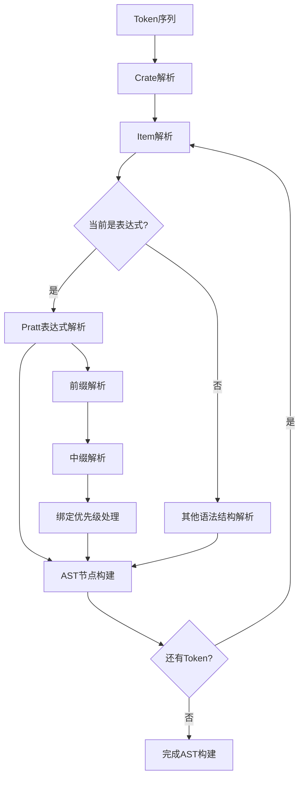
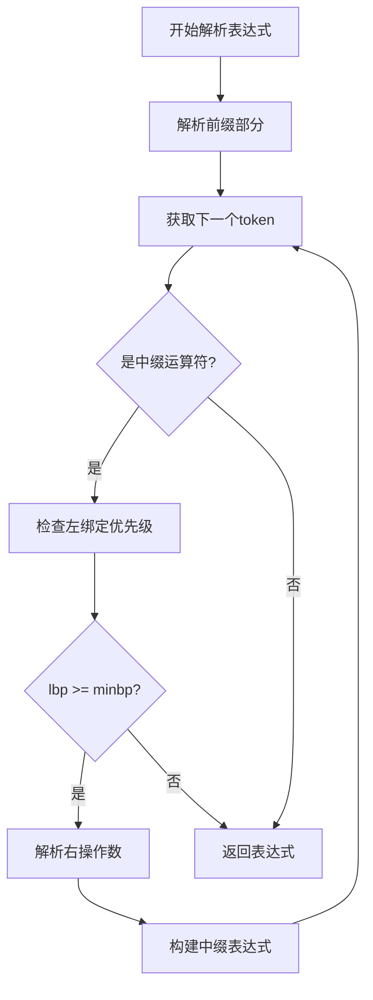
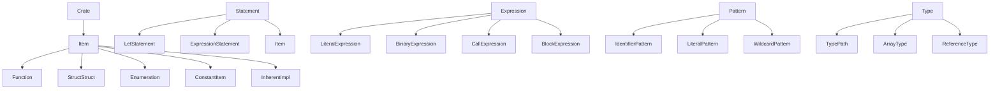
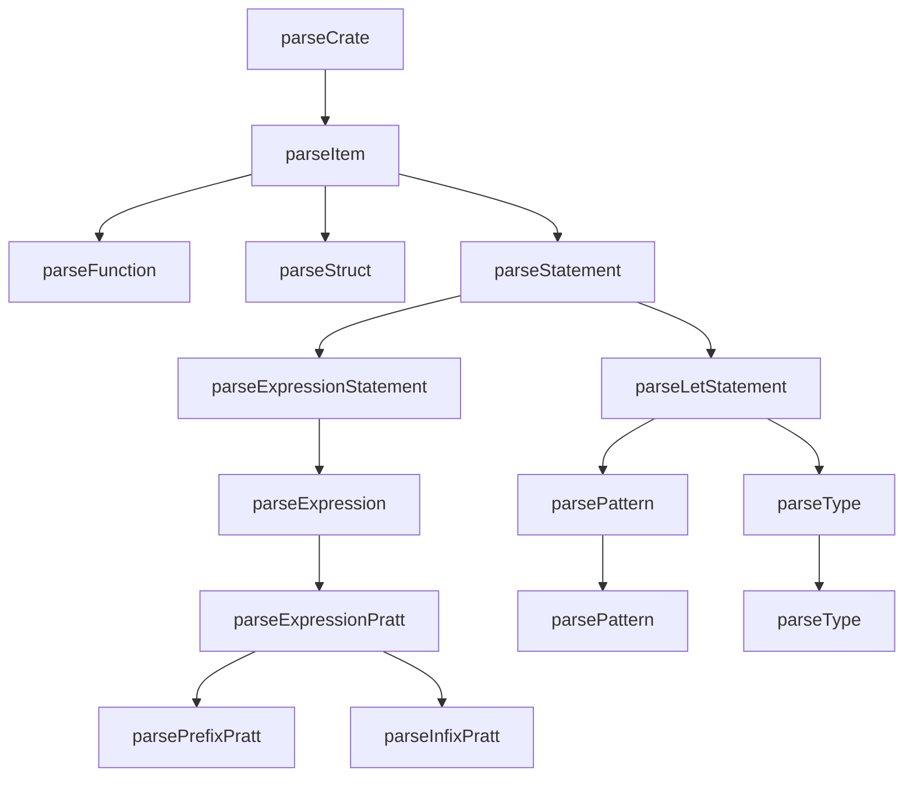

# Rx 语言编译器 Parser 综合分析文档

## 概述

Parser（语法分析器）是 Rx 语言编译器的第二个阶段，负责将 Lexer 输出的 token 序列转换为抽象语法树（AST）。Rx 编译器采用 Pratt 解析器（也称为 Top-Down Operator Precedence Parsing）来处理复杂的表达式语法和运算符优先级。

## 整体架构

### 文件结构
- [`include/parser.hpp`](../../include/parser.hpp) - Parser 类定义和绑定优先级枚举
- [`src/parser.cpp`](../../src/parser.cpp) - Parser 类实现
- [`include/astnodes.hpp`](../../include/astnodes.hpp) - AST 节点定义
- [`tests/parser_test.cpp`](../../tests/parser_test.cpp) - Parser 单元测试

### 核心组件

1. **Pratt 解析器引擎** - 基于绑定优先级的表达式解析
2. **绑定优先级系统** - 定义运算符的优先级和结合性
3. **Token 管理器** - 处理 token 序列的遍历和访问
4. **AST 构建器** - 构建各种类型的语法树节点
5. **语法规则解析器** - 处理语句、项、模式、类型等语法结构

## 工作流程

Parser 的工作流程可以概括为以下步骤：

1. **Token 序列输入** - 接收 Lexer 输出的 token 序列
2. **顶层解析** - 从 Crate 开始解析整个源文件
3. **项解析** - 解析函数、结构体、枚举等顶级项
4. **表达式解析** - 使用 Pratt 算法解析复杂表达式
5. **AST 构建** - 构建完整的抽象语法树
6. **输出结果** - 返回 AST 给语义分析器



## 技术特点

### 1. Pratt 解析器算法

Pratt 解析器是一种高效的表达式解析算法，具有以下特点：

- **统一的前缀和中缀处理**：通过绑定优先级区分前缀和中缀运算符
- **动态优先级管理**：运行时根据运算符类型决定解析优先级
- **自然处理结合性**：通过左右绑定优先级处理左结合和右结合

### 2. 绑定优先级系统

Parser 定义了完整的绑定优先级层次：

```cpp
enum BindingPower {
    PATH_ACCESS = 200,        // . 运算符
    CALL_INDEX = 190,         // () 和 [] 运算符
    STRUCT_EXPR = 185,        // {} 结构体表达式
    UNARY = 180,              // 一元运算符
    CAST = 170,               // as 类型转换
    MULT_DIV_MOD = 160,       // *, /, %
    ADD_SUB = 150,            // +, -
    SHIFT = 140,              // <<, >>
    BIT_AND = 130,            // &
    BIT_XOR = 120,            // ^
    BIT_OR = 110,             // |
    COMPARISON = 100,         // ==, !=, <, >, <=, >=
    LOGICAL_AND = 90,         // &&
    LOGICAL_OR = 80,          // ||
    ASSIGNMENT = 70,          // =, +=, -= 等
    FLOW_CONTROL = 60         // return, break
};
```

### 3. 分层解析策略

Parser 采用分层解析策略来处理不同的语法结构：

- **表达式层**：处理各种表达式，包括字面量、运算符、函数调用等
- **语句层**：处理 let 语句、表达式语句等
- **项层**：处理函数定义、结构体定义、impl 块等
- **模式层**：处理模式匹配语法
- **类型层**：处理类型注解

## Pratt 解析器核心算法详细分析

### 算法原理

Pratt 解析器的核心思想是将每个 token 与两个绑定优先级关联：

- **左绑定优先级（Left Binding Power, lbp）**：决定该 token 作为中缀运算符时的优先级
- **右绑定优先级（Right Binding Power, rbp）**：决定该 token 后面表达式的优先级

### 算法流程

Pratt 解析器包含两个主要阶段：

1. **前缀解析（Prefix Parsing）**：解析作为表达式开头的 token
2. **中缀解析（Infix Parsing）**：解析作为运算符的 token



### 核心方法实现分析

#### 1. parseExpression() - 表达式入口

[`parseExpression()`](../../src/parser.cpp:46) 是表达式解析的主入口：

```cpp
std::shared_ptr<Expression> Parser::parseExpression() {
    return parseExpressionPratt(0);
}
```

**工作方式**：
- 以最小绑定优先级 0 开始解析
- 确保整个表达式被完整解析，不受外部优先级限制

#### 2. parseExpressionPratt() - Pratt 算法核心

[`parseExpressionPratt()`](../../src/parser.cpp:49) 是 Pratt 算法的核心实现：

```cpp
std::shared_ptr<Expression> Parser::parseExpressionPratt(int minbp) {
    auto lhs = parsePrefixPratt();
    if (lhs == nullptr) {
        return nullptr;
    }
    return parseInfixPratt(std::move(lhs), minbp);
}
```

**工作方式**：
1. **前缀解析**：首先解析表达式的前缀部分
2. **中缀解析**：然后以解析出的左操作数为基础，继续解析中缀运算符
3. **优先级控制**：通过 `minbp` 参数控制解析的最小优先级

#### 3. parsePrefixPratt() - 前缀解析

[`parsePrefixPratt()`](../../src/parser.cpp:56) 处理所有可以作为表达式开头的 token：

```cpp
std::shared_ptr<Expression> Parser::parsePrefixPratt() {
    auto type = peek();
    switch (type) {
        case Token::kif:
            return parseIfExpression();
        case Token::kwhile:
            return parsePredicateLoopExpression();
        case Token::kloop:
            return parseInfiniteLoopExpression();
        case Token::kleftCurly:
            return parseBlockExpression();
        case Token::kconst:
            return parseConstBlockExpression();
        case Token::kINTEGER_LITERAL:
        case Token::kCHAR_LITERAL:
        case Token::kSTRING_LITERAL:
        case Token::kC_STRING_LITERAL:
        case Token::kRAW_STRING_LITERAL:
        case Token::kRAW_C_STRING_LITERAL:
        case Token::ktrue:
        case Token::kfalse: {
            auto string = getstring();
            advance();
            return std::make_shared<LiteralExpression>(string, type);
        }
        case Token::kleftParenthe:
            return parseGroupedExpression();
        case Token::kleftSquare:
            return parseArrayExpression();
        case Token::kMinus:
        case Token::kNot:
            return parseUnaryExpression();
        case Token::kAnd:
        case Token::kAndAnd:
            return parseBorrowExpression();
        case Token::kStar:
            return parseDereferenceExpression();
        case Token::kbreak:
            return parseBreakExpression();
        case Token::kcontinue: {
            advance();
            return std::make_shared<ContinueExpression>();
        }
        case Token::kreturn:
            return parseReturnExpression();
        case Token::kPathSep:
        case Token::kIDENTIFIER:
        case Token::kself:
        case Token::kSelf:
            return parsePathExpression();
        case Token::kEnd: {
            advance();
            return nullptr;
        }
        default:
            return nullptr;
    }
}
```

**支持的前缀表达式类型**：

1. **控制流表达式**：
   - `if` → [`parseIfExpression()`](../../src/parser.cpp:287)
   - `while` → [`parsePredicateLoopExpression()`](../../src/parser.cpp:278)
   - `loop` → [`parseInfiniteLoopExpression()`](../../src/parser.cpp:271)

2. **块表达式**：
   - `{` → [`parseBlockExpression()`](../../src/parser.cpp:220)
   - `const` → [`parseConstBlockExpression()`](../../src/parser.cpp:258)

3. **字面量表达式**：
   - 整数、字符、字符串、布尔值字面量
   - 直接创建 [`LiteralExpression`](../../include/astnodes.hpp:322)

4. **分组表达式**：
   - `(` → [`parseGroupedExpression()`](../../src/parser.cpp:317)

5. **数组表达式**：
   - `[` → [`parseArrayExpression()`](../../src/parser.cpp:331)

6. **一元运算符表达式**：
   - `-`, `!` → [`parseUnaryExpression()`](../../src/parser.cpp:348)

7. **借用表达式**：
   - `&`, `&&` → [`parseBorrowExpression()`](../../src/parser.cpp:355)

8. **解引用表达式**：
   - `*` → [`parseDereferenceExpression()`](../../src/parser.cpp:371)

9. **控制语句**：
   - `break` → [`parseBreakExpression()`](../../src/parser.cpp:380)
   - `continue` → 直接创建 [`ContinueExpression`](../../include/astnodes.hpp:445)
   - `return` → [`parseReturnExpression()`](../../src/parser.cpp:387)

10. **路径表达式**：
    - 标识符、`self`、`Self`、`::` → [`parsePathExpression()`](../../src/parser.cpp:309)

#### 4. parseInfixPratt() - 中缀解析

[`parseInfixPratt()`](../../src/parser.cpp:124) 是中缀解析的核心：

```cpp
std::shared_ptr<Expression> Parser::parseInfixPratt(std::shared_ptr<Expression> lhs, int minbp) {
    while (true) {
        auto type = peek();
        if (type == Token::kEnd || type == Token::krightParenthe || 
            type == Token::krightCurly || type == Token::kRightSquare) {
            break;
        }

        int leftbp = getLeftTokenBP(type);
        if (leftbp < minbp) {
            break;
        }
        
        // 特殊处理：return、break 等控制流语句不应该作为中缀运算符
        if (type == Token::kreturn || type == Token::kbreak) {
            break;
        }
        
        advance();

        if (type == Token::kleftParenthe) {
            lhs = parseCallExpressionFromInfix(std::move(lhs));
        } else if (type == Token::kleftSquare) {
            lhs = parseIndexExpressionFromInfix(std::move(lhs));
        } else if (type == Token::kleftCurly) {
            lhs = parseStructExpressionFromInfix(std::move(lhs));
        } else if (type == Token::kDot) {
            // 处理方法调用和字段访问
            size_t backup_pos = pos;
            
            if (match(Token::kIDENTIFIER)) {
                auto method_name = getstring();
                advance();
                
                if (match(Token::kleftParenthe)) {
                    advance();
                    auto callparams = parseCallParams();
                    if (match(Token::krightParenthe)) {
                        advance();
                        lhs = std::make_shared<MethodCallExpression>(std::move(lhs), method_name, std::move(callparams));
                        continue;
                    }
                }
                
                pos = backup_pos;
            }
            
            if (!match(Token::kIDENTIFIER)) {
                return nullptr;
            }
            auto identifier = getstring();
            advance();
            lhs = std::make_shared<FieldExpression>(std::move(lhs), identifier);
        }
        else if (type == Token::kas) {
            lhs = parseTypeCastExpressionFromInfix(std::move(lhs));
        } else {
            int rightbp = getRightTokenBP(type);
            auto rhs = parseExpressionPratt(rightbp);
            if (rhs == nullptr) {
                std::cerr << "Error: no expression after operand\n";
                return nullptr;
            }
            switch (type) {
                case Token::kEq: {
                    lhs = std::make_shared<AssignmentExpression>(std::move(lhs), std::move(rhs));
                    break;
                }
                case Token::kPlusEq:
                case Token::kMinusEq:
                case Token::kStarEq:
                case Token::kSlashEq:
                case Token::kPercentEq:
                case Token::kCaretEq:
                case Token::kAndEq:
                case Token::kOrEq:
                case Token::kShlEq:
                case Token::kShrEq: {
                    lhs = std::make_shared<CompoundAssignmentExpression>(std::move(lhs), std::move(rhs), type);
                    break;
                }
                default: {
                    lhs = std::make_shared<BinaryExpression>(std::move(lhs), std::move(rhs), type);
                }
            }
        }
    }
    return lhs;
}
```

**中缀解析的工作流程**：

1. **终止条件检查**：
   - 遇到结束 token（`kEnd`、右括号等）
   - 当前运算符的左绑定优先级小于最小要求优先级

2. **优先级检查**：
   ```cpp
   int leftbp = getLeftTokenBP(type);
   if (leftbp < minbp) {
       break;
   }
   ```

3. **特殊中缀运算符处理**：

   **函数调用**（`(`）：
   ```cpp
   if (type == Token::kleftParenthe) {
       lhs = parseCallExpressionFromInfix(std::move(lhs));
   }
   ```

   **索引访问**（`[`）：
   ```cpp
   else if (type == Token::kleftSquare) {
       lhs = parseIndexExpressionFromInfix(std::move(lhs));
   }
   ```

   **结构体表达式**（`{`）：
   ```cpp
   else if (type == Token::kleftCurly) {
       lhs = parseStructExpressionFromInfix(std::move(lhs));
   }
   ```

   **字段访问和方法调用**（`.`）：
   ```cpp
   else if (type == Token::kDot) {
       // 尝试解析为方法调用
       if (match(Token::kIDENTIFIER) && 后面跟着 '(') {
           lhs = std::make_shared<MethodCallExpression>(...);
       } else {
           // 解析为字段访问
           lhs = std::make_shared<FieldExpression>(...);
       }
   }
   ```

   **类型转换**（`as`）：
   ```cpp
   else if (type == Token::kas) {
       lhs = parseTypeCastExpressionFromInfix(std::move(lhs));
   }
   ```

4. **普通二元运算符处理**：
   ```cpp
   int rightbp = getRightTokenBP(type);
   auto rhs = parseExpressionPratt(rightbp);
   // 根据运算符类型创建相应的表达式节点
   ```

## 绑定优先级系统详细分析

### 优先级层次分析

#### 层次 1：最高优先级（200-185）

**PATH_ACCESS = 200** - 字段访问

**对应运算符**：`.`（点运算符）

**语法结构**：
- 字段访问：`obj.field`
- 方法调用：`obj.method()`

**解析特点**：
- 最高优先级，确保在复杂表达式中优先解析
- 支持链式调用：`a.b.c.method()`

**CALL_INDEX = 190** - 函数调用和索引

**对应运算符**：`(`、`[`

**语法结构**：
- 函数调用：`func(args)`
- 索引访问：`array[index]`

**解析特点**：
- 优先级仅次于字段访问
- 支持嵌套调用：`func1(arg1, func2(arg2))`

**STRUCT_EXPR = 185** - 结构体表达式

**对应运算符**：`{`

**语法结构**：
- 结构体实例化：`Struct { field: value }`

**解析特点**：
- 介于调用/索引和一元运算符之间
- 支持函数式结构体更新语法（未来扩展）

#### 层次 2：一元运算符（180-170）

**UNARY = 180** - 一元运算符

**对应运算符**：`-`、`!`、`&`、`&&`、`*`

**语法结构**：
- 算术取负：`-x`
- 逻辑非：`!condition`
- 借用：`&x`、`&mut x`、`&&x`
- 解引用：`*ptr`

**解析特点**：
- 作为前缀运算符处理
- 高优先级确保 `*a.b` 解析为 `*(a.b)` 而不是 `(*a).b`

**CAST = 170** - 类型转换

**对应运算符**：`as`

**语法结构**：
- 类型转换：`expr as Type`

**解析特点**：
- 右结合，优先级低于一元运算符
- 确保 `-x as i32` 解析为 `(-x) as i32`

#### 层次 3：算术运算符（160-140）

**MULT_DIV_MOD = 160** - 乘除模运算

**对应运算符**：`*`、`/`、`%`

**解析特点**：
- 左结合，优先级高于加减法
- 支持 `a * b * c` 解析为 `(a * b) * c`

**ADD_SUB = 150** - 加减运算

**对应运算符**：`+`、`-`

**解析特点**：
- 左结合，优先级低于乘除法
- 支持 `a + b + c` 解析为 `(a + b) + c`

**SHIFT = 140** - 移位运算

**对应运算符**：`<<`、`>>`

**解析特点**：
- 左结合，优先级低于加减法
- 与 Rust 语言规范一致

#### 层次 4：位运算符（130-110）

**BIT_AND = 130** - 按位与

**BIT_XOR = 120** - 按位异或

**BIT_OR = 110** - 按位或

**位运算符特点**：
- 左结合
- 优先级顺序：& > ^ > |（与 C/C++ 一致）

#### 层次 5：比较运算符（100）

**COMPARISON = 100** - 比较运算

**对应运算符**：`==`、`!=`、`<`、`>`、`<=`、`>=`

**解析特点**：
- 不支持链式比较（如 `a < b < c`）
- 每个比较运算符都是独立的二元运算

#### 层次 6：逻辑运算符（90-80）

**LOGICAL_AND = 90** - 逻辑与

**LOGICAL_OR = 80** - 逻辑或

**逻辑运算符特点**：
- 左结合
- 支持短路求值（在语义分析阶段处理）
- 优先级：&& 高于 ||

#### 层次 7：赋值运算符（70）

**ASSIGNMENT = 70** - 赋值运算

**对应运算符**：`=`、`+=`、`-=`、`*=`、`/=`、`%=`、`&=`、`|=`、`^=`、`<<=`、`>>=`

**解析特点**：
- 右结合（通过右绑定优先级 -1 实现）
- 支持链式赋值：`a = b = c`

#### 层次 8：最低优先级（60）

**FLOW_CONTROL = 60** - 控制流

**对应运算符**：`return`、`break`

**解析特点**：
- 最低优先级，不作为中缀运算符使用
- 在中缀解析中被特殊处理并跳过

### 左绑定优先级函数分析

[`getLeftTokenBP()`](../../src/parser.hpp:33) 函数实现：

```cpp
int getLeftTokenBP(Token token) {
    switch (token) {
        case Token::kDot:
            return PATH_ACCESS;  // 200
            
        case Token::kleftParenthe:
        case Token::kleftSquare:
            return CALL_INDEX;   // 190
            
        case Token::kleftCurly:
            return STRUCT_EXPR;  // 185
            
        case Token::kas:
            return CAST;         // 170
            
        case Token::kStar:
        case Token::kSlash:
        case Token::kPercent:
            return MULT_DIV_MOD; // 160
            
        case Token::kPlus:
        case Token::kMinus:
            return ADD_SUB;      // 150
            
        case Token::kShl:
        case Token::kShr:
            return SHIFT;        // 140
            
        case Token::kAnd:
            return BIT_AND;      // 130
            
        case Token::kCaret:
            return BIT_XOR;      // 120
            
        case Token::kOr:
            return BIT_OR;        // 110
            
        case Token::kEqEq:
        case Token::kNe:
        case Token::kLt:
        case Token::kGt:
        case Token::kLe:
        case Token::kGe:
            return COMPARISON;   // 100
            
        case Token::kAndAnd:
            return LOGICAL_AND;  // 90
            
        case Token::kOrOr:
            return LOGICAL_OR;   // 80
            
        case Token::kEq:
        case Token::kPlusEq:
        case Token::kMinusEq:
        case Token::kStarEq:
        case Token::kSlashEq:
        case Token::kPercentEq:
        case Token::kAndEq:
        case Token::kCaretEq:
        case Token::kOrEq:
        case Token::kShlEq:
        case Token::kShrEq:
            return ASSIGNMENT;   // 70
            
        case Token::kreturn:
        case Token::kbreak:
            return FLOW_CONTROL; // 60
            
        default:
            return -1; // 非运算符
    }
}
```

### 右绑定优先级函数分析

[`getRightTokenBP()`](../../src/parser.hpp:105) 函数实现：

```cpp
int getRightTokenBP(Token token) {
    switch (token) {
        case Token::kEq:
        case Token::kPlusEq:
        case Token::kMinusEq:
        case Token::kStarEq:
        case Token::kSlashEq:
        case Token::kPercentEq:
        case Token::kAndEq:
        case Token::kCaretEq:
        case Token::kOrEq:
        case Token::kShlEq:
        case Token::kShrEq:
            return getLeftTokenBP(token) - 1;  // 右结合
        
        default:
            return getLeftTokenBP(token);       // 左结合
    }
}
```

**关键设计分析**：

#### 赋值运算符的右结合性

```cpp
// 对于赋值运算符，右绑定优先级 = 左绑定优先级 - 1
// 左绑定：70，右绑定：69
```

**效果**：
- `a = b = c` 解析为 `a = (b = c)`
- 确保赋值表达式从右向左结合

#### 其他运算符的左结合性

```cpp
// 对于其他运算符，右绑定优先级 = 左绑定优先级
// 如 + 运算符：左绑定 150，右绑定 150
```

**效果**：
- `a + b + c` 解析为 `(a + b) + c`
- 确保算术运算符从左向右结合

## 表达式解析详细分析

### 表达式分类体系

Rx 编译器将表达式分为以下几大类：

1. **字面量表达式** - 基础数据值
2. **路径表达式** - 标识符和模块访问
3. **运算符表达式** - 各种运算符操作
4. **控制流表达式** - if、while、loop 等
5. **函数调用表达式** - 函数和方法调用
6. **结构体表达式** - 结构体实例化
7. **数组表达式** - 数组创建和访问
8. **借用表达式** - 引用和解引用

### 字面量表达式解析

#### 支持的字面量类型

在 [`parsePrefixPratt()`](../../src/parser.cpp:77) 中处理：

```cpp
case Token::kINTEGER_LITERAL:
case Token::kCHAR_LITERAL:
case Token::kSTRING_LITERAL:
case Token::kC_STRING_LITERAL:
case Token::kRAW_STRING_LITERAL:
case Token::kRAW_C_STRING_LITERAL:
case Token::ktrue:
case Token::kfalse: {
    auto string = getstring();
    advance();
    return std::make_shared<LiteralExpression>(string, type);
}
```

**字面量类型分析**：

1. **整数字面量**（`kINTEGER_LITERAL`）：
   - 支持十进制、十六进制、八进制、二进制
   - 由 Lexer 负责具体的数值解析

2. **字符字面量**（`kCHAR_LITERAL`）：
   - 单个字符，用单引号包围
   - 支持转义序列

3. **字符串字面量**：
   - 普通字符串（`kSTRING_LITERAL`）：双引号包围
   - C 字符串（`kC_STRING_LITERAL`）：以 null 结尾
   - 原始字符串（`kRAW_STRING_LITERAL`）：不处理转义
   - 原始 C 字符串（`kRAW_C_STRING_LITERAL`）：原始且以 null 结尾

4. **布尔字面量**：
   - `true`（`ktrue`）
   - `false`（`kfalse`）

**AST 节点**：创建 [`LiteralExpression`](../../include/astnodes.hpp:322)

### 路径表达式解析

#### 基本路径解析

[`parsePathExpression()`](../../src/parser.cpp:309) 实现路径解析：

```cpp
std::shared_ptr<PathExpression> Parser::parsePathExpression() {
    auto simplepath = std::move(parseSimplePath());
    if (simplepath == nullptr) {
        std::cerr << "Error: illegal simplepath\n";
        return nullptr;
    }
    return std::make_shared<PathExpression>(simplepath);
}
```

#### 简单路径解析

[`parseSimplePath()`](../../src/parser.cpp:558) 处理路径分段：

```cpp
std::shared_ptr<SimplePath> Parser::parseSimplePath() {
    if (match(Token::kPathSep)) {
        advance();
    }
    std::vector<std::shared_ptr<SimplePathSegment>> vec;
    vec.push_back(std::move(parseSimplePathSegment()));
    while (match(Token::kPathSep)) {
        advance();
        auto pathsegment = std::move(parseSimplePathSegment());
        if (pathsegment == nullptr) {
            std::cerr << "Error: illegal simplepathsegment\n";
            return nullptr;
        }
        vec.push_back(pathsegment);
    }
    return std::make_shared<SimplePath>(std::move(vec));
}
```

#### 路径分段解析

[`parseSimplePathSegment()`](../../src/parser.cpp:1149) 处理单个路径段：

```cpp
std::shared_ptr<SimplePathSegment> Parser::parseSimplePathSegment() {
    if (match(Token::kIDENTIFIER)) {
        auto str = getstring();
        advance();
        return std::make_shared<SimplePathSegment>(str, false, false);
    } else if (match(Token::kSelf)) {
        advance();
        return std::make_shared<SimplePathSegment>(std::string(), false, true);
    } else if (match(Token::kself)) {
        advance();
        return std::make_shared<SimplePathSegment>(std::string(), true, false);
    }
    return nullptr;
}
```

**路径类型分析**：

1. **标识符路径**：`module::function`
2. **绝对路径**：`::crate::item`
3. **Self 路径**：`Self::method`
4. **self 路径**：`self.field`

**AST 节点**：创建 [`PathExpression`](../../include/astnodes.hpp:333)

### 分组表达式解析

#### 圆括号分组

[`parseGroupedExpression()`](../../src/parser.cpp:317) 处理圆括号表达式：

```cpp
std::shared_ptr<GroupedExpression> Parser::parseGroupedExpression() {
    if (match(Token::kleftParenthe)) {
        advance();
    }
    auto expression = parseExpression();
    if (expression == nullptr) {
        return nullptr;
    }
    if (!match(Token::krightParenthe)) {
        return nullptr;
    }
    advance();
    return std::make_shared<GroupedExpression>(std::move(expression));
}
```

**功能**：
- 改变运算符优先级
- 支持嵌套分组
- 创建 [`GroupedExpression`](../../include/astnodes.hpp:343)

### 数组表达式解析

#### 数组创建语法

[`parseArrayExpression()`](../../src/parser.cpp:331) 处理数组创建：

```cpp
std::shared_ptr<ArrayExpression> Parser::parseArrayExpression() {
    if (match(Token::kleftSquare)) {
        advance();
    }
    auto arrayelements = parseArrayElements();
    if (!match(Token::kRightSquare)) {
        return nullptr;
    }
    advance();
    return std::make_shared<ArrayExpression>(std::move(arrayelements));
}
```

#### 数组元素解析

[`parseArrayElements()`](../../src/parser.cpp:576) 处理数组元素：

```cpp
std::shared_ptr<ArrayElements> Parser::parseArrayElements() {
    auto expression = parseExpression();
    std::vector<std::shared_ptr<Expression>> vec;
    vec.push_back(std::move(expression));
    if (match(Token::kSemi)) {
        // 重复数组语法 [expr; N]
        advance();
        auto expression2 = parseExpression();
        vec.push_back(std::move(expression2));
        return std::make_shared<ArrayElements>(std::move(vec), true);
    }
    while (match(Token::kComma)) {
        advance();
        auto expression2 = parseExpression();
        if (expression2 != nullptr) {
            vec.push_back(std::move(expression2));
        } else {
            break;
        }
    }
    return std::make_shared<ArrayElements>(std::move(vec), false);
}
```

**数组语法支持**：

1. **普通数组**：`[1, 2, 3]`
2. **重复数组**：`[0; 10]`（10 个 0）

**AST 节点**：创建 [`ArrayExpression`](../../include/astnodes.hpp:353)

### 一元运算符表达式解析

#### 一元运算符处理

[`parseUnaryExpression()`](../../src/parser.cpp:348) 处理一元运算符：

```cpp
std::shared_ptr<UnaryExpression> Parser::parseUnaryExpression() {
    auto unarytype = peek();
    advance();
    // 使用高优先级来解析操作数，确保一元运算符只绑定到紧随其后的主表达式
    auto expression = parseExpressionPratt(UNARY);
    return std::make_shared<UnaryExpression>(std::move(expression), unarytype);
}
```

**支持的一元运算符**：

1. **算术取负**：`-x`
2. **逻辑非**：`!x`

**关键设计**：使用 `UNARY` 优先级（180）确保一元运算符正确绑定

**AST 节点**：创建 [`UnaryExpression`](../../include/astnodes.hpp:663)

### 借用表达式解析

#### 借用运算符处理

[`parseBorrowExpression()`](../../src/parser.cpp:355) 处理借用表达式：

```cpp
std::shared_ptr<BorrowExpression> Parser::parseBorrowExpression() {
    auto borrowtype = peek();
    bool isdouble = (borrowtype == Token::kAndAnd);
    advance();
    
    bool ismut = false;
    if (match(Token::kmut)) {
        ismut = true;
        advance();
    }
    
    auto expression = parseExpressionPratt(UNARY);
    return std::make_shared<BorrowExpression>(std::move(expression), isdouble, ismut);
}
```

**借用类型分析**：

1. **单一借用**：`&x`、`&mut x`
2. **双重借用**：`&&x`、`&&mut x`

**AST 节点**：创建 [`BorrowExpression`](../../include/astnodes.hpp:688)

### 解引用表达式解析

#### 解引用运算符处理

[`parseDereferenceExpression()`](../../src/parser.cpp:371) 处理解引用：

```cpp
std::shared_ptr<DereferenceExpression> Parser::parseDereferenceExpression() {
    if (match(Token::kStar)) {
        advance();
    }
    auto expression = parseExpressionPratt(UNARY);
    return std::make_shared<DereferenceExpression>(std::move(expression));
}
```

**功能**：解引用指针，创建 [`DereferenceExpression`](../../include/astnodes.hpp:700)

### 控制流表达式解析

#### if 表达式

[`parseIfExpression()`](../../src/parser.cpp:287) 处理 if 表达式：

```cpp
std::shared_ptr<IfExpression> Parser::parseIfExpression() {
    if (!match(Token::kif)) {
        return nullptr;
    }
    advance();
    auto conditions = parseConditions();
    auto blockexpression = parseBlockExpression();
    std::shared_ptr<Expression> elseexpression = nullptr;
    if (match(Token::kelse)) {
        advance();
        if (match(Token::kif)) {
            elseexpression = parseIfExpression();  // else if
        } else {
            elseexpression = parseBlockExpression(); // else {}
        }
    }
    return std::make_shared<IfExpression>(std::move(conditions), std::move(blockexpression), std::move(elseexpression));
}
```

**if 表达式特性**：

1. **基本 if**：`if condition { }`
2. **if-else**：`if condition { } else { }`
3. **else if 链**：`if condition1 { } else if condition2 { } else { }`

**AST 节点**：创建 [`IfExpression`](../../include/astnodes.hpp:529)

#### while 循环表达式

[`parsePredicateLoopExpression()`](../../src/parser.cpp:278) 处理 while 循环：

```cpp
std::shared_ptr<PredicateLoopExpression> Parser::parsePredicateLoopExpression() {
    if (!match(Token::kwhile)) {
        return nullptr;
    }
    advance();
    auto conditions = parseConditions();
    auto expression = parseBlockExpression();
    return std::make_shared<PredicateLoopExpression>(std::move(conditions), std::move(expression));
}
```

**AST 节点**：创建 [`PredicateLoopExpression`](../../include/astnodes.hpp:517)

#### loop 循环表达式

[`parseInfiniteLoopExpression()`](../../src/parser.cpp:271) 处理无限循环：

```cpp
std::shared_ptr<InfiniteLoopExpression> Parser::parseInfiniteLoopExpression() {
    if (!match(Token::kloop)) {
        return nullptr;
    }
    advance();
    return std::make_shared<InfiniteLoopExpression>(std::move(parseBlockExpression()));
}
```

**AST 节点**：创建 [`InfiniteLoopExpression`](../../include/astnodes.hpp:507)

#### 块表达式

[`parseBlockExpression()`](../../src/parser.cpp:220) 处理块表达式：

```cpp
std::shared_ptr<BlockExpression> Parser::parseBlockExpression() {
    if (!match(Token::kleftCurly)) {
        return nullptr;
    }
    advance();
    std::vector<std::shared_ptr<Statement>> statements;
    while (pos < tokens.size() && !match(Token::krightCurly)) {
        auto tmp = pos;
        auto statement = parseStatement();
        if (statement != nullptr) {
            statements.push_back(std::move(statement));
            continue;
        }
        pos = tmp;
        auto expression = parseExpression();
        if (expression == nullptr) {
            std::cerr << "Error: not statement nor expression in blockexpression body at pos " << pos << "\";
            return nullptr;
        }
        if (dynamic_cast<IfExpression*>(expression.get()) == nullptr
         && dynamic_cast<BlockExpression*>(expression.get()) == nullptr
         && dynamic_cast<InfiniteLoopExpression*>(expression.get()) == nullptr
         && dynamic_cast<PredicateLoopExpression*>(expression.get()) == nullptr) {
            if (match(Token::krightCurly)) {
                advance();
                return std::make_shared<BlockExpression>(std::move(statements), std::move(expression));
            }
            std::cerr << "Error: neither statement nor expressionwithoutblock in blockexpression.\n";
            return nullptr;
        }
    }
    if (!match(Token::krightCurly)) {
        std::cerr << "Error: miss } after blockexpression at pos " << pos << "\n";
        return nullptr;
    }
    advance();
    return std::make_shared<BlockExpression>(std::move(statements), nullptr);
}
```

**块表达式特性**：

1. **语句序列**：包含多个语句
2. **表达式结果**：最后一个表达式作为块的返回值
3. **控制流表达式**：if、while、loop 等不需要分号

**AST 节点**：创建 [`BlockExpression`](../../include/astnodes.hpp:485)

#### const 块表达式

[`parseConstBlockExpression()`](../../src/parser.cpp:258) 处理 const 块：

```cpp
std::shared_ptr<ConstBlockExpression> Parser::parseConstBlockExpression() {
    if (!match(Token::kconst)) {
        return nullptr;
    }
    size_t tmp = pos;
    advance();
    auto expression = parseBlockExpression();
    if (expression != nullptr) {
        return std::make_shared<ConstBlockExpression>(std::move(expression));
    }
    pos = tmp;
    return nullptr;
}
```

**AST 节点**：创建 [`ConstBlockExpression`](../../include/astnodes.hpp:497)

### 跳转控制表达式解析

#### break 表达式

[`parseBreakExpression()`](../../src/parser.cpp:380) 处理 break：

```cpp
std::shared_ptr<BreakExpression> Parser::parseBreakExpression() {
    if (match(Token::kbreak)) {
        advance();
    }
    auto expression = parseExpression();
    return std::make_shared<BreakExpression>(std::move(expression));
}
```

**break 特性**：
- 支持带值返回：`break value`
- 支持无值返回：`break`

**AST 节点**：创建 [`BreakExpression`](../../include/astnodes.hpp:455)

#### continue 表达式

在 [`parsePrefixPratt()`](../../src/parser.cpp:98) 中直接处理：

```cpp
case Token::kcontinue: {
    advance();
    return std::make_shared<ContinueExpression>();
}
```

**AST 节点**：创建 [`ContinueExpression`](../../include/astnodes.hpp:445)

#### return 表达式

[`parseReturnExpression()`](../../src/parser.cpp:387) 处理 return：

```cpp
std::shared_ptr<ReturnExpression> Parser::parseReturnExpression() {
    if (match(Token::kreturn)) {
        advance();
    }
    auto expression = parseExpression();
    return std::make_shared<ReturnExpression>(std::move(expression));
}
```

**return 特性**：
- 支持带值返回：`return value`
- 支持无值返回：`return`

**AST 节点**：创建 [`ReturnExpression`](../../include/astnodes.hpp:465)

### 中缀表达式解析

在 [`parseInfixPratt()`](../../src/parser.cpp:124) 中的中缀处理：

#### 函数调用表达式

[`parseCallExpressionFromInfix()`](../../src/parser.cpp:422) 处理函数调用：

```cpp
std::shared_ptr<CallExpression> Parser::parseCallExpressionFromInfix(std::shared_ptr<Expression> callee) {
    auto callparams = parseCallParams();
    if (!match(Token::krightParenthe)) {
        return nullptr;
    }
    advance();
    return std::make_shared<CallExpression>(std::move(callee), std::move(callparams));
}
```

#### 索引访问表达式

[`parseIndexExpressionFromInfix()`](../../src/parser.cpp:450) 处理索引访问：

```cpp
std::shared_ptr<IndexExpression> Parser::parseIndexExpressionFromInfix(std::shared_ptr<Expression> lhs) {
    auto expressionin = parseExpression();
    if (!match(Token::kRightSquare)) {
        return nullptr;
    }
    advance();
    return std::make_shared<IndexExpression>(std::move(lhs), std::move(expressionin));
}
```

#### 字段访问和方法调用

在 [`parseInfixPratt()`](../../src/parser.cpp:149) 中的点运算符处理：

```cpp
else if (type == Token::kDot) {
    // 处理方法调用表达式和字段访问表达式
    size_t backup_pos = pos;  // 保存当前位置以便回溯
    
    if (match(Token::kIDENTIFIER)) {
        auto method_name = getstring();
        advance();
        
        // 检查后面是否跟着左括号，这是方法调用的标志
        if (match(Token::kleftParenthe)) {
            advance();  // 消费左括号
            auto callparams = parseCallParams();
            if (match(Token::krightParenthe)) {
                advance();  // 消费右括号
                lhs = std::make_shared<MethodCallExpression>(std::move(lhs), method_name, std::move(callparams));
                continue;
            }
        }
        
        pos = backup_pos;
    }
    
    if (!match(Token::kIDENTIFIER)) {
        return nullptr;
    }
    auto identifier = getstring();
    advance();
    lhs = std::make_shared<FieldExpression>(std::move(lhs), identifier);
}
```

**处理逻辑**：
1. 尝试解析为方法调用：`obj.method(args)`
2. 如果失败，回退并解析为字段访问：`obj.field`

#### 类型转换表达式

[`parseTypeCastExpressionFromInfix()`](../../src/parser.cpp:472) 处理类型转换：

```cpp
std::shared_ptr<TypeCastExpression> Parser::parseTypeCastExpressionFromInfix(std::shared_ptr<Expression> lhs) {
    auto typenobounds = parseType();
    return std::make_shared<TypeCastExpression>(std::move(lhs), std::move(typenobounds));
}
```

#### 二元运算符表达式

在 [`parseInfixPratt()`](../../src/parser.cpp:184) 中的二元运算符处理：

```cpp
else {
    int rightbp = getRightTokenBP(type);
    auto rhs = parseExpressionPratt(rightbp);
    if (rhs == nullptr) {
        std::cerr << "Error: no expression after operand\n";
        return nullptr;
    }
    switch (type) {
        case Token::kEq: {
            lhs = std::make_shared<AssignmentExpression>(std::move(lhs), std::move(rhs));
            break;
        }
        case Token::kPlusEq:
        case Token::kMinusEq:
        case Token::kStarEq:
        case Token::kSlashEq:
        case Token::kPercentEq:
        case Token::kCaretEq:
        case Token::kAndEq:
        case Token::kOrEq:
        case Token::kShlEq:
        case Token::kShrEq: {
            lhs = std::make_shared<CompoundAssignmentExpression>(std::move(lhs), std::move(rhs), type);
            break;
        }
        default: {
            lhs = std::make_shared<BinaryExpression>(std::move(lhs), std::move(rhs), type);
        }
    }
}
```

**运算符类型**：

1. **赋值运算符**：创建 [`AssignmentExpression`](../../include/astnodes.hpp:558)
2. **复合赋值运算符**：创建 [`CompoundAssignmentExpression`](../../include/astnodes.hpp:570)
3. **普通二元运算符**：创建 [`BinaryExpression`](../../include/astnodes.hpp:674)

### 结构体表达式解析

[`parseStructExpressionFromInfix()`](../../src/parser.cpp:1278) 处理结构体实例化：

```cpp
std::shared_ptr<StructExpression> Parser::parseStructExpressionFromInfix(std::shared_ptr<Expression> path) {
    auto pathExpr = std::dynamic_pointer_cast<PathExpression>(path);
    if (pathExpr == nullptr) {
        std::cerr << "Error: path in struct expression must be a PathExpression\n";
        return nullptr;
    }
    
    if (match(Token::krightCurly)) {
        advance();
        return std::make_shared<StructExpression>(pathExpr, nullptr);
    }
    
    auto structExprFields = parseStructExprFields();
    if (structExprFields == nullptr) {
        return nullptr;
    }
    
    if (!match(Token::krightCurly)) {
        return nullptr;
    }
    advance();
    
    return std::make_shared<StructExpression>(pathExpr, structExprFields);
}
```

**结构体表达式特性**：

1. **空结构体**：`Struct { }`
2. **字段初始化**：`Struct { field1: value1, field2: value2 }`

**AST 节点**：创建 [`StructExpression`](../../include/astnodes.hpp:396)

### 调用参数解析

[`parseCallParams()`](../../src/parser.cpp:605) 处理函数调用参数：

```cpp
std::shared_ptr<CallParams> Parser::parseCallParams() {
    std::vector<std::shared_ptr<Expression>> vec;
    
    if (match(Token::krightParenthe)) {
        return std::make_shared<CallParams>(std::move(vec));
    }
    
    auto expression = parseExpression();
    if (expression != nullptr) {
        vec.push_back(std::move(expression));
    }
    
    while (match(Token::kComma)) {
        advance();
        if (match(Token::krightParenthe)) {
            break;
        }
        auto nextExpression = parseExpression();
        if (nextExpression != nullptr) {
            vec.push_back(std::move(nextExpression));
        }
    }
    
    return std::make_shared<CallParams>(std::move(vec));
}
```

**调用参数特性**：

1. **无参数**：`func()`
2. **单参数**：`func(arg)`
3. **多参数**：`func(arg1, arg2, arg3)`
4. **尾随逗号**：`func(arg1, arg2,)`

**AST 节点**：创建 [`CallParams`](../../include/astnodes.hpp:639)

### 条件解析

[`parseConditions()`](../../src/parser.cpp:536) 处理条件表达式：

```cpp
std::shared_ptr<Conditions> Parser::parseConditions() {
    if (!match(Token::kleftParenthe)) {
        return nullptr;
    }
    advance();
    auto expression = parseExpression();
    if (expression == nullptr) {
        std::cerr << "Error: failed to parse expression in conditions\n";
        return nullptr;
    }
    if (!match(Token::krightParenthe)) {
        std::cerr << "Error: expected ) after expression in conditions\n";
        return nullptr;
    }
    advance();
    auto p = expression.get();
    if (dynamic_cast<StructExpression*>(p) == nullptr) {
        return std::make_shared<Conditions>(std::move(expression));
    }
    return nullptr;
}
```

**条件特性**：

1. **圆括号包围**：`(condition)`
2. **任意表达式**：支持复杂的条件表达式
3. **结构体排除**：不允许结构体表达式作为条件

**AST 节点**：创建 [`Conditions`](../../include/astnodes.hpp:649)

## 语句解析详细分析

### 语句分类体系

Rx 编译器将语句分为以下几类：

1. **Let 语句** - 变量绑定和初始化
2. **表达式语句** - 表达式作为语句使用
3. **项定义语句** - 函数、结构体、常量等定义
4. **空语句** - 仅包含分号的语句

### 语句解析入口

#### parseStatement() 方法

[`parseStatement()`](../../src/parser.cpp:487) 是语句解析的主入口：

```cpp
std::shared_ptr<Statement> Parser::parseStatement() {
    if (match(Token::kSemi)) {
        advance();
        return nullptr;
    }
    if (match(Token::klet)) {
        auto letstatement = std::move(parseLetStatement());
        if (letstatement == nullptr) {
            std::cerr << "Error: illegal Letstatement in statement\n";
            return nullptr;
        }
        return std::make_shared<Statement>(letstatement);
    }
    
    // 先尝试解析表达式语句，因为像 while、if、loop 等都是表达式
    size_t tmp = pos;
    auto expressionstatement = parseExpressionStatement();
    if (expressionstatement != nullptr) {
        return std::make_shared<Statement>(std::move(expressionstatement));
    }
    pos = tmp;

    // 只有在表达式解析失败时，才尝试解析 item
    tmp = pos;
    auto item = parseItem();
    if (item != nullptr) {
        return std::make_shared<Statement>(std::move(item));
    }
    pos = tmp;
    return nullptr;
}
```

**解析策略分析**：

1. **空语句处理**：直接跳过分号
2. **Let 语句优先**：let 语句有明确的标识符，优先匹配
3. **表达式语句次之**：尝试解析为表达式语句
4. **项定义最后**：当前面都失败时，尝试解析为项定义

### Let 语句解析

#### parseLetStatement() 方法

[`parseLetStatement()`](../../src/parser.cpp:1086) 处理 let 绑定语句：

```cpp
std::shared_ptr<LetStatement> Parser::parseLetStatement() {
    if (!match(Token::klet)) {
        return nullptr;
    }
    advance();
    auto pattern = parsePattern();
    if (pattern == nullptr) {
        return nullptr;
    }
    if (!match(Token::kColon)) {
        return nullptr;
    }
    advance();
    auto type = parseType();
    if (type == nullptr) {
        return nullptr;
    }
    std::shared_ptr<Expression> expression = nullptr;
    if (match(Token::kEq)) {
        advance();
        expression = parseExpression();
        if (expression == nullptr) {
            return nullptr;
        }
    }
    if (!match(Token::kSemi)) {
        return nullptr;
    }
    advance();
    return std::make_shared<LetStatement>(std::move(pattern), std::move(type), std::move(expression));
}
```

**Let 语句语法结构**：

```
let PATTERN: TYPE = EXPRESSION;
```

**解析步骤分析**：

1. **let 关键字**：确认是 let 语句
2. **模式解析**：解析变量绑定模式
3. **类型注解**：解析冒号后的类型（必需）
4. **初始化表达式**：解析等号后的表达式（可选）
5. **分号结束**：必须以分号结束

**Let 语句示例**：

```rust
let x: i32;                    // 仅声明
let y: i32 = 42;               // 声明并初始化
let (a, b): (i32, i32) = (1, 2); // 模式解构
```

**AST 节点**：创建 [`LetStatement`](../../include/astnodes.hpp:289)

### 表达式语句解析

#### parseExpressionStatement() 方法

[`parseExpressionStatement()`](../../src/parser.cpp:1118) 处理表达式语句：

```cpp
std::shared_ptr<ExpressionStatement> Parser::parseExpressionStatement() {
    auto tmp = pos;
    auto expressionwithblock = parseExpressionWithBlock();
    if (expressionwithblock != nullptr) {
        bool hassemi = false;
        if (match(Token::kSemi)) {
            hassemi = true;
            advance();
        }
        return std::make_shared<ExpressionStatement>(std::move(expressionwithblock), hassemi);
    }
    pos = tmp;
    auto expression = parseExpression();
    if (expression == nullptr) {
        return nullptr;
    }
    if (match(Token::kSemi)) {
        advance();
        return std::make_shared<ExpressionStatement>(std::move(expression), true);
    }
    auto ptr = expression.get();
    if (dynamic_cast<BlockExpression*>(ptr) != nullptr
     || dynamic_cast<ConstBlockExpression*>(ptr) != nullptr
     || dynamic_cast<InfiniteLoopExpression*>(ptr) != nullptr
     || dynamic_cast<PredicateLoopExpression*>(ptr) != nullptr
     || dynamic_cast<IfExpression*>(ptr) != nullptr
     || dynamic_cast<ReturnExpression*>(ptr) != nullptr) {
        return std::make_shared<ExpressionStatement>(std::move(expression), false);
    }
    return nullptr;
}
```

**表达式语句处理逻辑**：

1. **带块表达式优先**：尝试解析 if、while、loop、块等
2. **普通表达式次之**：解析其他表达式
3. **分号处理**：
   - 带块表达式：分号可选
   - 普通表达式：通常需要分号
4. **特殊表达式免分号**：某些表达式不需要分号

#### 带块表达式的分号处理

**需要分号的带块表达式**：
- `if condition { }`（当有返回值时）
- `while condition { }`
- `loop { }`
- `{ statements }`

**不需要分号的带块表达式**：
- `return expr`
- `break expr`
- `continue`

**分号规则分析**：

```cpp
// 带块表达式的分号处理
auto expressionwithblock = parseExpressionWithBlock();
if (expressionwithblock != nullptr) {
    bool hassemi = false;
    if (match(Token::kSemi)) {
        hassemi = true;
        advance();
    }
    return std::make_shared<ExpressionStatement>(std::move(expressionwithblock), hassemi);
}
```

#### 普通表达式的分号处理

```cpp
// 普通表达式的分号处理
auto expression = parseExpression();
if (expression == nullptr) {
    return nullptr;
}
if (match(Token::kSemi)) {
    advance();
    return std::make_shared<ExpressionStatement>(std::move(expression), true);
}

// 检查是否为不需要分号的特殊表达式
auto ptr = expression.get();
if (dynamic_cast<BlockExpression*>(ptr) != nullptr
 || dynamic_cast<ConstBlockExpression*>(ptr) != nullptr
 || dynamic_cast<InfiniteLoopExpression*>(ptr) != nullptr
 || dynamic_cast<PredicateLoopExpression*>(ptr) != nullptr
 || dynamic_cast<IfExpression*>(ptr) != nullptr
 || dynamic_cast<ReturnExpression*>(ptr) != nullptr) {
    return std::make_shared<ExpressionStatement>(std::move(expression), false);
}
```

**表达式语句示例**：

```rust
let x = 5;                    // let 语句
x + 1;                        // 普通表达式语句
println!("hello");             // 函数调用语句
if condition { }               // if 表达式语句（可选分号）
while condition { }            // while 表达式语句（可选分号）
return 42;                    // return 语句（不需要分号）
```

**AST 节点**：创建 [`ExpressionStatement`](../../include/astnodes.hpp:303)

### 项定义语句解析

#### parseItem() 方法

[`parseItem()`](../../src/parser.cpp:688) 处理项定义：

```cpp
std::shared_ptr<Item> Parser::parseItem() {
    std::shared_ptr<ASTNode> astnode = nullptr;
    if (match(Token::kstruct)) {
        astnode = parseStruct();
    } else if (match(Token::kenum)) {
        astnode = parseEnumeration();
    } else if (match(Token::kimpl)) {
        astnode = parseInherentImpl();
    } else if (match(Token::kfn)) {
        astnode = parseFunction();
    } else if (match(Token::kconst)) {
        if (pos + 1 < tokens.size() && tokens[pos + 1].first == Token::kfn) {
            astnode = parseFunction();
        } else {
            astnode = parseConstantItem();
        }
    }
    // 如果遇到 }，说明块结束，不应该报错
    if (match(Token::krightCurly)) {
        return nullptr;
    }
    if (astnode == nullptr) {
        return nullptr;
    }
    return std::make_shared<Item>(astnode);
}
```

**项类型分析**：

1. **结构体定义**：`struct` → [`parseStruct()`](../../src/parser.cpp:788)
2. **枚举定义**：`enum` → [`parseEnumeration()`](../../src/parser.cpp:813)
3. **实现块**：`impl` → [`parseInherentImpl()`](../../src/parser.cpp:837)
4. **函数定义**：`fn` → [`parseFunction()`](../../src/parser.cpp:716)
5. **常量定义**：`const` → [`parseConstantItem()`](../../src/parser.cpp:756)
6. **const 函数**：`const fn` → [`parseFunction()`](../../src/parser.cpp:716)

**const 歧义处理**：

```cpp
if (match(Token::kconst)) {
    if (pos + 1 < tokens.size() && tokens[pos + 1].first == Token::kfn) {
        astnode = parseFunction();      // const fn
    } else {
        astnode = parseConstantItem();  // const 常量
    }
}
```

**项定义示例**：

```rust
struct Point { x: i32, y: i32 }    // 结构体定义
enum Color { Red, Green, Blue }     // 枚举定义
impl Point { fn new() -> Self { } } // 实现块
fn add(a: i32, b: i32) -> i32 { }  // 函数定义
const PI: f64 = 3.14159;           // 常量定义
const fn sqrt(x: f64) -> f64 { }    // const 函数定义
```

**AST 节点**：创建 [`Item`](../../include/astnodes.hpp:34)

### 语句在块中的处理

#### 块表达式中的语句解析

在 [`parseBlockExpression()`](../../src/parser.cpp:220) 中的语句处理：

```cpp
std::vector<std::shared_ptr<Statement>> statements;
while (pos < tokens.size() && !match(Token::krightCurly)) {
    auto tmp = pos;
    auto statement = parseStatement();
    if (statement != nullptr) {
        statements.push_back(std::move(statement));
        continue;
    }
    pos = tmp;
    auto expression = parseExpression();
    if (expression == nullptr) {
        std::cerr << "Error: not statement nor expression in blockexpression body at pos " << pos << "\n";
        return nullptr;
    }
    if (dynamic_cast<IfExpression*>(expression.get()) == nullptr
     && dynamic_cast<BlockExpression*>(expression.get()) == nullptr
     && dynamic_cast<InfiniteLoopExpression*>(expression.get()) == nullptr
     && dynamic_cast<PredicateLoopExpression*>(expression.get()) == nullptr) {
        if (match(Token::krightCurly)) {
            advance();
            return std::make_shared<BlockExpression>(std::move(statements), std::move(expression));
        }
        std::cerr << "Error: neither statement nor expressionwithoutblock in blockexpression.\n";
        return nullptr;
    }
}
```

**块内处理策略**：

1. **优先解析语句**：尝试解析为语句
2. **回退解析表达式**：语句解析失败时尝试解析表达式
3. **表达式分类处理**：
   - 带块表达式：作为块的最终返回值
   - 普通表达式：需要分号，否则报错

#### 块的返回值处理

**带返回值的块**：
```rust
{
    let x = 1;
    let y = 2;
    x + y  // 块的返回值，不需要分号
}
```

**无返回值的块**：
```rust
{
    let x = 1;
    println!("x = {}", x);  // 语句，需要分号
}  // 返回 ()
```

## 项解析详细分析

### 项分类体系

Rx 编译器支持以下类型的项：

1. **函数定义** - 包括普通函数和 const 函数
2. **结构体定义** - 字段结构体和单元结构体
3. **枚举定义** - 变体枚举
4. **常量定义** - 编译时常量
5. **实现块** - 类型的固有实现

### 项解析入口

#### parseItem() 方法

[`parseItem()`](../../src/parser.cpp:688) 是项解析的主入口：

```cpp
std::shared_ptr<Item> Parser::parseItem() {
    std::shared_ptr<ASTNode> astnode = nullptr;
    if (match(Token::kstruct)) {
        astnode = parseStruct();
    } else if (match(Token::kenum)) {
        astnode = parseEnumeration();
    } else if (match(Token::kimpl)) {
        astnode = parseInherentImpl();
    } else if (match(Token::kfn)) {
        astnode = parseFunction();
    } else if (match(Token::kconst)) {
        if (pos + 1 < tokens.size() && tokens[pos + 1].first == Token::kfn) {
            astnode = parseFunction();
        } else {
            astnode = parseConstantItem();
        }
    }
    // 如果遇到 }，说明块结束，不应该报错
    if (match(Token::krightCurly)) {
        return nullptr;
    }
    if (astnode == nullptr) {
        return nullptr;
    }
    return std::make_shared<Item>(astnode);
}
```

**解析策略分析**：

1. **关键字匹配**：根据第一个关键字确定项类型
2. **const 歧义处理**：区分 `const` 常量和 `const fn` 函数
3. **块结束处理**：遇到 `}` 时返回 nullptr，避免错误
4. **统一包装**：所有项都包装为 `Item` AST 节点

### 函数定义解析

#### parseFunction() 方法

[`parseFunction()`](../../src/parser.cpp:716) 处理函数定义：

```cpp
std::shared_ptr<Function> Parser::parseFunction() {
    bool isconst = false;
    if (match(Token::kconst)) {
        advance();
        isconst = true;
    }
    if (!match(Token::kfn)) {
        return nullptr;
    }
    advance();
    if (!match(Token::kIDENTIFIER)) {
        return nullptr;
    }
    auto identifier = getstring();
    advance();
    if (!match(Token::kleftParenthe)) {
        return nullptr;
    }
    advance();
    std::shared_ptr<FunctionParameters> parameters = nullptr;
    if (!match(Token::krightParenthe)) {
        parameters = std::move(parseFunctionParameters());
    }
    if (!match(Token::krightParenthe)) {
        return nullptr;
    }
    advance();
    std::shared_ptr<FunctionReturnType> type(std::move(parseFunctionReturnType()));
    std::shared_ptr<BlockExpression> expression = nullptr;
    if (!match(Token::kSemi)) {
        expression = std::move(parseBlockExpression());
        if (expression == nullptr) {
            std::cerr << "Error: illegal blockexpression in function\n";
            return nullptr;
        }
    } else {
        advance();
    }
    return std::make_shared<Function>(isconst, std::move(identifier), std::move(parameters), std::move(type), std::move(expression));
}
```

**函数定义语法结构**：

```
[const] fn IDENTIFIER(PARAMETERS) -> RETURN_TYPE [BLOCK_EXPRESSION];
```

**解析步骤分析**：

1. **const 修饰符**：检查是否为 const 函数
2. **fn 关键字**：确认是函数定义
3. **函数名**：解析标识符
4. **参数列表**：解析圆括号内的参数
5. **返回类型**：解析可选的返回类型
6. **函数体**：解析块表达式或分号

**函数定义示例**：

```rust
fn add(a: i32, b: i32) -> i32 { a + b }     // 普通函数
const fn PI() -> f64 { 3.14159 }              // const 函数
fn print_hello() { println!("hello"); }        // 无返回值函数
extern fn external_func();                      // 外部函数声明
```

**AST 节点**：创建 [`Function`](../../include/astnodes.hpp:44)

#### 函数参数解析

##### parseFunctionParameters() 方法

[`parseFunctionParameters()`](../../src/parser.cpp:866) 处理函数参数列表：

```cpp
std::shared_ptr<FunctionParameters> Parser::parseFunctionParameters() {
    std::vector<std::shared_ptr<FunctionParam>> vec;
    bool hasSelf = false;
    bool selfIsRef = false;
    bool selfIsMut = false;
    
    auto param = parseFunctionParam();
    if (param == nullptr) {
        return nullptr;
    }
    
    // 检查是否是 self 参数
    auto refPattern = dynamic_cast<ReferencePattern*>(param->patternnotopalt.get());
    auto identPattern = dynamic_cast<IdentifierPattern*>(param->patternnotopalt.get());
    
    if (refPattern != nullptr) {
        auto innerPattern = refPattern->pattern;
        if (innerPattern != nullptr) {
            auto innerIdentPattern = dynamic_cast<IdentifierPattern*>(innerPattern.get());
            if (innerIdentPattern != nullptr && innerIdentPattern->identifier == "self") {
                hasSelf = true;
                selfIsRef = true;
                selfIsMut = refPattern->hasmut;
            }
        }
    } else if (identPattern != nullptr && identPattern->identifier == "self") {
        hasSelf = true;
        selfIsMut = identPattern->hasmut;
    }
    
    vec.push_back(std::move(param));
    
    while (match(Token::kComma)) {
        advance();
        if (match(Token::krightParenthe)) {
            break;
        }
        auto param = parseFunctionParam();
        if (param == nullptr) {
            return nullptr;
        }
        vec.push_back(std::move(param));
    }
    if (match(Token::kComma)) {
        advance();
    }
    
    auto functionParams = std::make_shared<FunctionParameters>(std::move(vec));
    functionParams->hasSelfParam = hasSelf;
    functionParams->selfIsRef = selfIsRef;
    functionParams->selfIsMut = selfIsMut;
    
    return functionParams;
}
```

**self 参数检测**：

1. **&self**：引用形式的 self
2. **&mut self**：可变引用形式的 self
3. **self**：值形式的 self
4. **mut self**：可变值形式的 self

**参数列表特性**：

- 支持多个参数
- 支持尾随逗号
- 特殊处理 self 参数

##### parseFunctionParam() 方法

[`parseFunctionParam()`](../../src/parser.cpp:928) 处理单个函数参数：

```cpp
std::shared_ptr<FunctionParam> Parser::parseFunctionParam() {
    auto pattern = parsePattern();
    if (pattern == nullptr) {
        return nullptr;
    }
    
    // 检查是否是特殊的 self 模式
    auto refPattern = dynamic_cast<ReferencePattern*>(pattern.get());
    auto identPattern = dynamic_cast<IdentifierPattern*>(pattern.get());
    bool isSpecialSelfPattern = false;
    
    if (refPattern != nullptr) {
        auto innerPattern = refPattern->pattern;
        if (innerPattern != nullptr) {
            auto innerIdentPattern = dynamic_cast<IdentifierPattern*>(innerPattern.get());
            if (innerIdentPattern != nullptr && innerIdentPattern->identifier == "self") {
                isSpecialSelfPattern = true;
            }
        }
    } else if (identPattern != nullptr && identPattern->identifier == "self") {
        isSpecialSelfPattern = true;
    }
    
    if (isSpecialSelfPattern) {
        // 对于特殊的 self 模式，不需要类型注解
        auto dummyType = std::make_shared<TypePath>(std::make_shared<SimplePathSegment>("", false, false));
        return std::make_shared<FunctionParam>(std::move(pattern), std::move(dummyType));
    }
    
    // 对于普通参数，需要类型注解
    if (!match(Token::kColon)) {
        return nullptr;
    }
    advance();
    auto type = parseType();
    if (type == nullptr) {
        return nullptr;
    }
    return std::make_shared<FunctionParam>(std::move(pattern), std::move(type));
}
```

**参数类型分析**：

1. **self 参数**：不需要类型注解，类型由上下文推断
2. **普通参数**：需要显式类型注解

#### 函数返回类型解析

##### parseFunctionReturnType() 方法

[`parseFunctionReturnType()`](../../src/parser.cpp:920) 处理返回类型：

```cpp
std::shared_ptr<FunctionReturnType> Parser::parseFunctionReturnType() {
    if (!match(Token::kRArrow)) {
        return nullptr;
    }
    advance();
    auto type = parseType();
    return std::make_shared<FunctionReturnType>(std::move(type));
}
```

**返回类型特性**：

- 可选的返回类型注解
- 使用 `->` 符号指定
- 默认返回单元类型 `()`

**AST 节点**：创建 [`FunctionReturnType`](../../include/astnodes.hpp:170)

### 结构体定义解析

#### parseStruct() 方法

[`parseStruct()`](../../src/parser.cpp:788) 处理结构体定义：

```cpp
std::shared_ptr<StructStruct> Parser::parseStruct() {
    if (!match(Token::kstruct)) {
        return nullptr;
    }
    advance();
    if (!match(Token::kIDENTIFIER)) {
        return nullptr;
    }
    auto identifier = getstring();
    advance();
    
    if (match(Token::kleftCurly)) {
        advance();
        auto structfields = parseStructFields();
        if (!match(Token::krightCurly)) {
            return nullptr;
        }
        advance();
        return std::make_shared<StructStruct>(identifier, std::move(structfields), false);
    } else if (match(Token::kSemi)) {
        return std::make_shared<StructStruct>(identifier, nullptr, true);
    } else {
        return nullptr;
    }
}
```

**结构体类型分析**：

1. **字段结构体**：`struct Name { field1: Type1, field2: Type2 }`
2. **单元结构体**：`struct Name;`

**解析步骤**：

1. **struct 关键字**：确认是结构体定义
2. **结构体名**：解析标识符
3. **结构体类型判断**：
   - `{` 开始：字段结构体
   - `;` 结束：单元结构体

**AST 节点**：创建 [`StructStruct`](../../include/astnodes.hpp:89)

#### 结构体字段解析

##### parseStructFields() 方法

[`parseStructFields()`](../../src/parser.cpp:971) 处理结构体字段：

```cpp
std::shared_ptr<StructFields> Parser::parseStructFields() {
    std::vector<std::shared_ptr<StructField>> vec;
    
    // 检查是否为空的结构体
    if (match(Token::krightCurly)) {
        return std::make_shared<StructFields>(std::move(vec));
    }
    
    auto field = parseStructField();
    if (field == nullptr) {
        return nullptr;
    }
    vec.push_back(std::move(field));
    
    // 修复：正确处理字段间的逗号和可选的尾随逗号
    while (true) {
        // 检查是否有逗号
        if (match(Token::kComma)) {
            advance();
            
            // 检查逗号后是否是右大括号（尾随逗号）
            if (match(Token::krightCurly)) {
                break;
            }
            
            // 解析下一个字段
            auto nextField = parseStructField();
            if (nextField == nullptr) {
                return nullptr;
            }
            vec.push_back(std::move(nextField));
        } else if (match(Token::krightCurly)) {
            // 没有逗号，直接遇到右大括号
            break;
        } else {
            // 既不是逗号也不是右大括号，语法错误
            return nullptr;
        }
    }
    
    return std::make_shared<StructFields>(std::move(vec));
}
```

**字段列表特性**：

- 支持空结构体：`struct Empty { }`
- 支持尾随逗号：`struct S { a: i32, }`
- 字段间用逗号分隔

##### parseStructField() 方法

[`parseStructField()`](../../src/parser.cpp:1013) 处理单个结构体字段：

```cpp
std::shared_ptr<StructField> Parser::parseStructField() {
    if (!match(Token::kIDENTIFIER)) {
        return nullptr;
    }
    auto identifier = getstring();
    advance();
    if (!match(Token::kColon)) {
        return nullptr;
    }
    advance();
    auto type = parseType();
    if (!type) {
        return nullptr;
    }
    return std::make_shared<StructField>(identifier, std::move(type));
}
```

**字段语法**：`identifier: Type`

**AST 节点**：创建 [`StructField`](../../include/astnodes.hpp:190)

### 枚举定义解析

#### parseEnumeration() 方法

[`parseEnumeration()`](../../src/parser.cpp:813) 处理枚举定义：

```cpp
std::shared_ptr<Enumeration> Parser::parseEnumeration() {
    if (!match(Token::kenum)) {
        return nullptr;
    }
    advance();
    if (!match(Token::kIDENTIFIER)) {
        return nullptr;
    }
    auto identifier = getstring();
    advance();
    if (!match(Token::kleftCurly)) {
        return nullptr;
    }
    advance();
    auto enumvariants = parseEnumVariants();
    if (enumvariants == nullptr) {
        return nullptr;
    }
    if (!match(Token::krightCurly)) {
        return nullptr;
    }
    advance();
    return std::make_shared<Enumeration>(identifier, std::move(enumvariants));
}
```

**枚举语法结构**：

```
enum IDENTIFIER {
    VARIANT1,
    VARIANT2,
    ...
}
```

**AST 节点**：创建 [`Enumeration`](../../include/astnodes.hpp:115)

#### 枚举变体解析

##### parseEnumVariants() 方法

[`parseEnumVariants()`](../../src/parser.cpp:1030) 处理枚举变体列表：

```cpp
std::shared_ptr<EnumVariants> Parser::parseEnumVariants() {
    std::vector<std::shared_ptr<EnumVariant>> vec;
    
    // 检查是否为空的 enum
    if (match(Token::krightCurly)) {
        return std::make_shared<EnumVariants>(std::move(vec));
    }
    
    auto variant = parseEnumVariant();
    if (variant == nullptr) {
        return nullptr;
    }
    vec.push_back(std::move(variant));
    while (match(Token::kComma)) {
        advance();
        // 检查逗号后是否是右大括号（尾随逗号）
        if (match(Token::krightCurly)) {
            break;
        }
        auto variant = parseEnumVariant();
        if (variant == nullptr) {
            return nullptr;
        }
        vec.push_back(std::move(variant));
    }
    if (match(Token::kComma)) {
        advance();
    }
    return std::make_shared<EnumVariants>(std::move(vec));
}
```

**变体列表特性**：

- 支持空枚举：`enum Empty { }`
- 支持尾随逗号：`enum E { A, B, }`
- 变体间用逗号分隔

##### parseEnumVariant() 方法

[`parseEnumVariant()`](../../src/parser.cpp:1060) 处理单个枚举变体：

```cpp
std::shared_ptr<EnumVariant> Parser::parseEnumVariant() {
    if (!match(Token::kIDENTIFIER)) {
        return nullptr;
    }
    auto identifier = getstring();
    advance();
    return std::make_shared<EnumVariant>(identifier);
}
```

**当前实现**：仅支持简单变体（无参数的变体）

**AST 节点**：创建 [`EnumVariant`](../../include/astnodes.hpp:234)

### 常量定义解析

#### parseConstantItem() 方法

[`parseConstantItem()`](../../src/parser.cpp:756) 处理常量定义：

```cpp
std::shared_ptr<ConstantItem> Parser::parseConstantItem() {
    if (!match(Token::kconst)) {
        return nullptr;
    }
    advance();
    if (!match(Token::kIDENTIFIER)) {
        return nullptr;
    }
    auto identifier = getstring();
    advance();
    if (!match(Token::kColon)) {
        return nullptr;
    }
    advance();
    auto type = parseType();
    std::shared_ptr<Expression> expression = nullptr;
    if (match(Token::kEq)) {
        advance();
        expression = parseExpression();
        if (expression == nullptr) {
            return nullptr;
        }
    }
    if (!match(Token::kSemi)) {
        return nullptr;
    }
    advance();
    return std::make_shared<ConstantItem>(identifier, std::move(type), std::move(expression));
}
```

**常量语法结构**：

```
const IDENTIFIER: TYPE [= EXPRESSION];
```

**常量特性**：

- 必须有类型注解
- 初始化表达式可选
- 必须以分号结束

**常量示例**：

```rust
const MAX_SIZE: usize = 1024;     // 带初始化值
const MIN_VALUE: i32;            // 仅声明（外部定义）
```

**AST 节点**：创建 [`ConstantItem`](../../include/astnodes.hpp:63)

### 实现块解析

#### parseInherentImpl() 方法

[`parseInherentImpl()`](../../src/parser.cpp:837) 处理固有实现块：

```cpp
std::shared_ptr<InherentImpl> Parser::parseInherentImpl() {
    if (!match(Token::kimpl)) {
        return nullptr;
    }
    advance();
    auto type = parseType();
    if (type == nullptr) {
        return nullptr;
    }
    if (!match(Token::kleftCurly)) {
        return nullptr;
    }
    advance();
    std::vector<std::shared_ptr<AssociatedItem>> items;
    while (!match(Token::krightCurly)) {
        auto item = parseAssociatedItem();
        if (item == nullptr) {
            // 如果遇到 }，说明 impl 块结束，不应该报错
            if (match(Token::krightCurly)) {
                break;
            }
            return nullptr;
        }
        items.push_back(std::move(item));
    }
    advance();
    return std::make_shared<InherentImpl>(std::move(type), std::move(items));
}
```

**impl 块语法结构**：

```
impl TYPE {
    ASSOCIATED_ITEMS
}
```

**解析步骤**：

1. **impl 关键字**：确认是实现块
2. **类型名**：解析要实现的类型
3. **大括号内容**：解析关联项列表

**AST 节点**：创建 [`InherentImpl`](../../include/astnodes.hpp:127)

#### 关联项解析

##### parseAssociatedItem() 方法

[`parseAssociatedItem()`](../../src/parser.cpp:1069) 处理关联项：

```cpp
std::shared_ptr<AssociatedItem> Parser::parseAssociatedItem() {
    if (match(Token::kfn)) {
        return std::make_shared<AssociatedItem>(std::move(parseFunction()));
    } else if (match(Token::kconst)) {
        if (pos + 1 < tokens.size() && tokens[pos + 1].first == Token::kfn) {
            return std::make_shared<AssociatedItem>(std::move(parseFunction()));
        } else {
            return std::make_shared<AssociatedItem>(std::move(parseConstantItem()));
        }
    }
    // 如果遇到 }，说明 impl 块结束，不应该报错
    if (match(Token::krightCurly)) {
        return nullptr;
    }
    return nullptr;
}
```

**关联项类型**：

1. **关联函数**：`fn method(&self) { }`
2. **关联常量**：`const ASSOC: Type = value;`
3. **const 关联函数**：`const fn const_method() { }`

**AST 节点**：创建 [`AssociatedItem`](../../include/astnodes.hpp:262)

### Crate 解析

#### parseCrate() 方法

[`parseCrate()`](../../src/parser.cpp:677) 处理整个 crate：

```cpp
std::shared_ptr<Crate> Parser::parseCrate() {
    std::vector<std::shared_ptr<Item>> items;
    while (pos < tokens.size()) {
        auto item = parseItem();
        if (item == nullptr) {
            return nullptr;
        }
        items.push_back(std::move(item));
    }
    return std::make_shared<Crate>(std::move(items));
}
```

**Crate 特性**：

- 包含所有顶级项
- 按顺序解析所有项
- 构建完整的 AST 根节点

**AST 节点**：创建 [`Crate`](../../include/astnodes.hpp:24)

## 模式解析详细分析

### 模式分类体系

Rx 编译器支持以下类型的模式：

1. **通配符模式** - `_` 忽略匹配
2. **标识符模式** - 变量绑定模式
3. **字面量模式** - 常量值匹配
4. **引用模式** - `&` 和 `&mut` 模式
5. **路径模式** - 枚举变体和常量匹配

### 模式解析入口

#### parsePattern() 方法

[`parsePattern()`](../../src/parser.cpp:1181) 是模式解析的主入口：

```cpp
std::shared_ptr<Pattern> Parser::parsePattern() {
    if (match(Token::kUnderscore)) {
        advance();
        return std::make_shared<WildcardPattern>();
    } else if (match(Token::kAnd) || match(Token::kAndAnd)) {
        return parseReferencePattern();
    } else if (match(Token::kref) || match(Token::kmut) || match(Token::kIDENTIFIER) || match(Token::kself)) {
        return parseIdentifierPattern();
    } else if (match(Token::kMinus)) {
        return parseLiteralPattern();
    } else {
        return nullptr;
    }
}
```

**解析策略分析**：

1. **通配符优先**：`_` 有明确的标识符，优先匹配
2. **引用模式次之**：`&` 和 `&&` 有明确的标识符
3. **标识符模式**：`ref`、`mut`、标识符、`self`
4. **字面量模式**：以 `-` 开头的负数字面量
5. **其他情况**：返回 nullptr

### 通配符模式解析

#### 通配符语法

在 [`parsePattern()`](../../src/parser.cpp:1182) 中直接处理：

```cpp
if (match(Token::kUnderscore)) {
    advance();
    return std::make_shared<WildcardPattern>();
}
```

**通配符特性**：

- 使用 `_` 表示
- 忽略匹配的值
- 不绑定变量
- 常用于不需要的参数或值

**通配符示例**：

```rust
let _ = 42;                    // 忽略值
fn foo(_: i32, y: i32) { }     // 忽略第一个参数
let (x, _) = (1, 2);          // 忽略元组的第二个元素
```

**AST 节点**：创建 [`WildcardPattern`](../../include/astnodes.hpp:741)

### 引用模式解析

#### parseReferencePattern() 方法

[`parseReferencePattern()`](../../src/parser.cpp:1202) 处理引用模式：

```cpp
std::shared_ptr<ReferencePattern> Parser::parseReferencePattern() {
    bool singleordouble = false;
    if (match(Token::kAnd)) {
        singleordouble = false;
    } else if (match(Token::kAndAnd)) {
        singleordouble = true;
    } else {
        return nullptr;
    }
    advance();
    bool ismut = false;
    if (match(Token::kmut)) {
        ismut = true;
        advance();
    }
    auto pattern = parsePattern();
    if (pattern == nullptr) {
        return nullptr;
    }
    return std::make_shared<ReferencePattern>(singleordouble, ismut, std::move(pattern));
}
```

**引用模式语法结构**：

```
[&|&&] [mut] PATTERN
```

**引用模式类型**：

1. **单一引用**：`&pattern`
2. **双重引用**：`&&pattern`
3. **可变引用**：`&mut pattern`
4. **双重可变引用**：`&&mut pattern`

**解析步骤分析**：

1. **引用符号**：确定是 `&` 还是 `&&`
2. **可变修饰符**：检查是否有 `mut`
3. **子模式**：递归解析被引用的模式

**引用模式示例**：

```rust
let &x = &value;              // 单一引用
let &&x = &&value;            // 双重引用
let &mut x = &mut value;       // 可变引用
let &&mut x = &&mut value;     // 双重可变引用
```

**AST 节点**：创建 [`ReferencePattern`](../../include/astnodes.hpp:757)

### 标识符模式解析

#### parseIdentifierPattern() 方法

[`parseIdentifierPattern()`](../../src/parser.cpp:1239) 处理标识符模式：

```cpp
std::shared_ptr<IdentifierPattern> Parser::parseIdentifierPattern() {
    bool isref = false;
    if (match(Token::kref)) {
        isref = true;
        advance();
    }
    bool ismut = false;
    if (match(Token::kmut)) {
        ismut = true;
        advance();
    }
    if (!match(Token::kIDENTIFIER) && !match(Token::kself)) {
        return nullptr;
    }
    auto identifier = getstring();
    advance();
    return std::make_shared<IdentifierPattern>(isref, ismut, identifier, nullptr);
}
```

**标识符模式语法结构**：

```
[ref] [mut] IDENTIFIER
```

**标识符模式特性**：

1. **ref 修饰符**：按引用绑定（当前实现中未完全使用）
2. **mut 修饰符**：可变绑定
3. **标识符**：变量名或 `self`
4. **不支持模式守卫**：当前实现不支持 `@` 模式守卫

**标识符模式示例**：

```rust
let x = value;                 // 普通绑定
let mut x = value;             // 可变绑定
let ref x = value;             // 引用绑定
let ref mut x = value;         // 可变引用绑定
let self = value;              // self 绑定
```

**AST 节点**：创建 [`IdentifierPattern`](../../include/astnodes.hpp:728)

### 字面量模式解析

#### parseLiteralPattern() 方法

[`parseLiteralPattern()`](../../src/parser.cpp:1223) 处理字面量模式：

```cpp
std::shared_ptr<LiteralPattern> Parser::parseLiteralPattern() {
    bool neg = false;
    if (match(Token::kMinus)) {
        neg = true;
        advance();
    }
    auto expression = parseExpression();
    if (expression == nullptr) {
        return nullptr;
    }
    auto p = dynamic_cast<LiteralExpression*>(expression.get());
    if (p == nullptr) {
        return nullptr;
    }
    return std::make_shared<LiteralPattern>(neg, std::move(expression));
}
```

**字面量模式语法结构**：

```
[-] LITERAL_EXPRESSION
```

**字面量模式特性**：

1. **负数支持**：支持 `-` 前缀的负数字面量
2. **字面量类型**：必须是字面量表达式
3. **类型检查**：动态检查是否为字面量表达式

**字面量模式示例**：

```rust
let 42 = value;               // 正数字面量
let -42 = value;              // 负数字面量
let "hello" = value;          // 字符串字面量
let 'a' = value;             // 字符字面量
let true = value;             // 布尔字面量
```

**AST 节点**：创建 [`LiteralPattern`](../../include/astnodes.hpp:717)

### 模式在函数参数中的应用

#### 特殊 self 模式处理

在 [`parseFunctionParam()`](../../src/parser.cpp:928) 中的特殊处理：

```cpp
// 检查是否是特殊的 self 模式（&self, &mut self, self, mut self）
// 这些模式不需要类型注解
auto refPattern = dynamic_cast<ReferencePattern*>(pattern.get());
auto identPattern = dynamic_cast<IdentifierPattern*>(pattern.get());
bool isSpecialSelfPattern = false;

if (refPattern != nullptr) {
    auto innerPattern = refPattern->pattern;
    if (innerPattern != nullptr) {
        auto innerIdentPattern = dynamic_cast<IdentifierPattern*>(innerPattern.get());
        if (innerIdentPattern != nullptr && innerIdentPattern->identifier == "self") {
            isSpecialSelfPattern = true;
        }
    }
} else if (identPattern != nullptr && identPattern->identifier == "self") {
    isSpecialSelfPattern = true;
}

if (isSpecialSelfPattern) {
    // 对于特殊的 self 模式，不需要类型注解
    // 创建一个虚拟的类型，因为 FunctionParam 需要类型
    auto dummyType = std::make_shared<TypePath>(std::make_shared<SimplePathSegment>("", false, false));
    return std::make_shared<FunctionParam>(std::move(pattern), std::move(dummyType));
}
```

**self 模式类型**：

1. **self**：值形式的 self
2. **mut self**：可变值形式的 self
3. **&self**：引用形式的 self
4. **&mut self**：可变引用形式的 self
5. **&&self**：双重引用形式的 self
6. **&&mut self**：双重可变引用形式的 self

**self 模式示例**：

```rust
impl Type {
    fn method(self) { }           // 值形式
    fn method_mut(mut self) { }    // 可变值形式
    fn method_ref(&self) { }       // 引用形式
    fn method_ref_mut(&mut self) { } // 可变引用形式
}
```

### 模式在 let 语句中的应用

#### let 语句中的模式

在 [`parseLetStatement()`](../../src/parser.cpp:1086) 中使用模式：

```cpp
auto pattern = parsePattern();
if (pattern == nullptr) {
    return nullptr;
}
```

**let 语句中的模式示例**：

```rust
let x = value;                  // 标识符模式
let _ = value;                  // 通配符模式
let (a, b) = (1, 2);          // 元组模式（未实现）
let &x = &value;               // 引用模式
let 42 = value;                // 字面量模式
```

## 类型解析详细分析

### 类型分类体系

Rx 编译器支持以下类型：

1. **基本类型** - 标识符表示的简单类型
2. **引用类型** - `&T` 和 `&mut T` 引用类型
3. **数组类型** - `[T; N]` 固定大小数组类型
4. **单元类型** - `()` 空元组类型
5. **路径类型** - 模块路径和泛型类型

### 类型解析入口

#### parseType() 方法

[`parseType()`](../../src/parser.cpp:635) 是类型解析的主入口：

```cpp
std::shared_ptr<Type> Parser::parseType() {
    auto type = peek();
    switch (type) {
        case Token::kIDENTIFIER:
        case Token::kSelf:
        case Token::kself:
            return parseTypePath();
        
        case Token::kleftSquare: {
            advance();
            auto tp = parseType();
            if (!match(Token::kSemi)) {
                return nullptr;
            }
            advance();
            auto expression = parseExpression();
            if (!match(Token::kRightSquare)) {
                return nullptr;
            }
            advance();
            return std::make_shared<ArrayType>(std::move(tp), std::move(expression));
        }
        
        case Token::kAnd:
            return parseReferenceType();
        
        case Token::kleftParenthe: {
            advance();
            if (!match(Token::krightParenthe)) {
                return nullptr;
            }
            advance();
            return std::make_shared<UnitType>();
        }
                
        default:
            return nullptr;
    }
}
```

**解析策略分析**：

1. **标识符类型**：基本类型和路径类型
2. **数组类型**：以 `[` 开头的数组语法
3. **引用类型**：以 `&` 开头的引用语法
4. **单元类型**：空括号 `()`
5. **其他情况**：返回 nullptr

### 路径类型解析

#### parseTypePath() 方法

[`parseTypePath()`](../../src/parser.cpp:1163) 处理路径类型：

```cpp
std::shared_ptr<TypePath> Parser::parseTypePath() {
    auto simplepath = parseSimplePathSegment();
    return std::make_shared<TypePath>(std::move(simplepath));
}
```

**路径类型特性**：

- 使用单个路径段（当前实现限制）
- 支持基本类型名：`i32`、`String`、`Vec` 等
- 支持 `Self` 和 `self` 类型

**路径类型示例**：

```rust
i32                              // 基本类型
String                           // 字符串类型
Vec<i32>                         // 泛型类型（未来扩展）
Self                             // 类型别名
self                             // 实例类型
```

**AST 节点**：创建 [`TypePath`](../../include/astnodes.hpp:795)

#### parseSimplePathSegment() 方法

[`parseSimplePathSegment()`](../../src/parser.cpp:1149) 在类型解析中的使用：

```cpp
if (match(Token::kIDENTIFIER)) {
    auto str = getstring();
    advance();
    return std::make_shared<SimplePathSegment>(str, false, false);
} else if (match(Token::kSelf)) {
    advance();
    return std::make_shared<SimplePathSegment>(std::string(), false, true);
} else if (match(Token::kself)) {
    advance();
    return std::make_shared<SimplePathSegment>(std::string(), true, false);
}
```

**路径段类型**：

1. **标识符段**：普通类型名
2. **Self 段**：类型别名
3. **self 段**：实例类型

### 数组类型解析

#### 数组类型语法

在 [`parseType()`](../../src/parser.cpp:643) 中的数组类型处理：

```cpp
case Token::kleftSquare: {
    advance();
    auto tp = parseType();
    if (!match(Token::kSemi)) {
        return nullptr;
    }
    advance();
    auto expression = parseExpression();
    if (!match(Token::kRightSquare)) {
        return nullptr;
    }
    advance();
    return std::make_shared<ArrayType>(std::move(tp), std::move(expression));
}
```

**数组类型语法结构**：

```
[TYPE; EXPRESSION]
```

**解析步骤分析**：

1. **左方括号**：`[` 确认是数组类型
2. **元素类型**：解析数组的元素类型
3. **分号分隔**：`;` 分隔类型和大小
4. **大小表达式**：解析数组大小的常量表达式
5. **右方括号**：`]` 结束数组类型

**数组类型示例**：

```rust
[i32; 10]                        // 10 个 i32 的数组
[String; 5]                       // 5 个字符串的数组
[Vec<i32>; 3]                     // 3 个向量的数组（未来扩展）
[&str; 100]                       // 100 个字符串引用的数组
```

**AST 节点**：创建 [`ArrayType`](../../include/astnodes.hpp:805)

**数组类型特性**：

- 固定大小数组，大小在编译时确定
- 大小必须是常量表达式
- 元素类型可以是任意有效类型

### 引用类型解析

#### parseReferenceType() 方法

[`parseReferenceType()`](../../src/parser.cpp:1167) 处理引用类型：

```cpp
std::shared_ptr<ReferenceType> Parser::parseReferenceType() {
    if (!match(Token::kAnd)) {
        return nullptr;
    }
    advance();
    bool ismut = false;
    if (match(Token::kmut)) {
        ismut = true;
        advance();
    }
    auto type = parseType();
    return std::make_shared<ReferenceType>(std::move(type), ismut);
}
```

**引用类型语法结构**：

```
& [mut] TYPE
```

**引用类型类型**：

1. **不可变引用**：`&T`
2. **可变引用**：`&mut T`

**解析步骤分析**：

1. **引用符号**：`&` 确认是引用类型
2. **可变修饰符**：检查是否有 `mut`
3. **被引用类型**：递归解析被引用的类型

**引用类型示例**：

```rust
&i32                              // i32 的不可变引用
&mut i32                          // i32 的可变引用
&String                           // String 的不可变引用
&mut String                       // String 的可变引用
&[i32; 10]                       // 数组的不可变引用
&mut [i32; 10]                   // 数组的可变引用
&Vec<i32>                         // 向量的不可变引用（未来扩展）
```

**AST 节点**：创建 [`ReferenceType`](../../include/astnodes.hpp:816)

**引用类型特性**：

- 支持对任意类型的引用
- 区分可变和不可变引用
- 引用类型本身也是类型系统的一部分

### 单元类型解析

#### 单元类型语法

在 [`parseType()`](../../src/parser.cpp:661) 中的单元类型处理：

```cpp
case Token::kleftParenthe: {
    advance();
    if (!match(Token::krightParenthe)) {
        return nullptr;
    }
    advance();
    return std::make_shared<UnitType>();
}
```

**单元类型语法结构**：

```
()
```

**解析步骤分析**：

1. **左括号**：`(` 开始
2. **立即右括号**：`)` 确认是空括号
3. **创建单元类型**：返回 `UnitType`

**单元类型示例**：

```rust
()                                // 单元类型
fn func() -> () { }                // 返回单元类型
let x: () = ();                    // 单元类型变量
```

**AST 节点**：创建 [`UnitType`](../../include/astnodes.hpp:827)

**单元类型特性**：

- 表示空值或无返回值
- 函数默认返回类型
- 只有一个值 `()`
- 内存大小为 0

### 类型在语法结构中的应用

#### 函数参数类型

在 [`parseFunctionParam()`](../../src/parser.cpp:960) 中的类型解析：

```cpp
// 对于普通参数，需要类型注解
if (!match(Token::kColon)) {
    return nullptr;
}
advance();
auto type = parseType();
if (type == nullptr) {
    return nullptr;
}
```

**函数参数类型示例**：

```rust
fn func(x: i32, y: &mut String) { }    // 参数类型注解
fn method(&self, x: [i32; 5]) { }      // self 参数和数组类型
```

#### 函数返回类型

在 [`parseFunctionReturnType()`](../../src/parser.cpp:925) 中的类型解析：

```cpp
if (!match(Token::kRArrow)) {
    return nullptr;
}
advance();
auto type = parseType();
return std::make_shared<FunctionReturnType>(std::move(type));
```

**函数返回类型示例**：

```rust
fn func() -> i32 { }                   // 基本类型返回
fn func() -> &String { }                // 引用类型返回
fn func() -> [i32; 10] { }            // 数组类型返回
fn func() -> () { }                     // 单元类型返回
```

#### let 语句类型

在 [`parseLetStatement()`](../../src/parser.cpp:1095) 中的类型解析：

```cpp
if (!match(Token::kColon)) {
    return nullptr;
}
advance();
auto type = parseType();
if (type == nullptr) {
    return nullptr;
}
```

**let 语句类型示例**：

```rust
let x: i32 = 42;                      // 基本类型
let y: &mut String = String::new();     // 可变引用类型
let arr: [i32; 5] = [1, 2, 3, 4, 5]; // 数组类型
let unit: () = ();                      // 单元类型
```

#### 结构体字段类型

在 [`parseStructField()`](../../src/parser.cpp:1022) 中的类型解析：

```cpp
advance();
auto type = parseType();
if (!type) {
    return nullptr;
}
```

**结构体字段类型示例**：

```rust
struct Point {
    x: i32,                           // 基本类型字段
    y: i32,                           // 基本类型字段
}
struct Container {
    data: [String; 10],                // 数组类型字段
    reference: &mut Vec<i32>,          // 可变引用类型字段
}
```

#### 常量类型

在 [`parseConstantItem()`](../../src/parser.cpp:769) 中的类型解析：

```cpp
advance();
auto type = parseType();
std::shared_ptr<Expression> expression = nullptr;
```

**常量类型示例**：

```rust
const MAX_SIZE: usize = 1024;           // 基本类型常量
const DEFAULT: [i32; 3] = [1, 2, 3]; // 数组类型常量
const EMPTY: () = ();                  // 单元类型常量
```

## 组件交互接口详细分析

### 与 Lexer 的交互

#### 输入接口

Parser 的构造函数接收 Lexer 的输出：

```cpp
Parser::Parser(std::vector<std::pair<Token, std::string>> tokens) : tokens(tokens) { }
```

**数据结构分析**：

```cpp
std::vector<std::pair<Token, std::string>> tokens
```

- **Token 类型**：词法单元的枚举类型
- **string 类型**：token 的字符串值
- **vector 容器**：有序的 token 序列

#### Token 操作接口

Parser 提供了四个核心的 Token 操作方法：

##### peek() 方法

[`peek()`](../../src/parser.cpp:13) 查看当前 token：

```cpp
Token Parser::peek() {
    if (pos >= tokens.size()) return Token::kEnd;
    while (pos < tokens.size() && tokens[pos].first == Token::kCOMMENT) ++pos;
    return tokens[pos].first;
}
```

**功能特性**：
- 返回当前 token 类型，不移动位置
- 自动跳过注释 token
- 超出范围时返回 `kEnd`

**使用场景**：
- 条件判断：`if (match(Token::klet))`
- 类型检查：`switch (peek())`
- 错误检测：验证预期 token

##### match() 方法

[`match()`](../../src/parser.cpp:18) 匹配特定 token：

```cpp
bool Parser::match(Token token) {
    return peek() == token;
}
```

**功能特性**：
- 检查当前 token 是否为指定类型
- 调用 `peek()`，自动处理注释跳过
- 返回布尔值结果

**使用场景**：
- 语法检查：`if (!match(Token::kleftParenthe))`
- 分支选择：`else if (match(Token::krightCurly))`
- 循环控制：`while (match(Token::kComma))`

##### advance() 方法

[`advance()`](../../src/parser.cpp:21) 前进到下一个 token：

```cpp
void Parser::advance() {
    ++pos;
}
```

**功能特性**：
- 简单的位置递增
- 不返回任何值
- 与 `peek()` 配合使用

**使用场景**：
- 消费 token：在确认匹配后前进
- 跳过 token：如跳过分号、括号等
- 位置管理：控制解析进度

##### getstring() 方法

[`getstring()`](../../src/parser.cpp:24) 获取当前 token 字符串值：

```cpp
std::string Parser::getstring() {
    if (pos >= tokens.size()) return "";
    return tokens[pos].second;
}
```

**功能特性**：
- 返回当前 token 的字符串值
- 超出范围时返回空字符串
- 不移动位置

**使用场景**：
- 标识符获取：`auto identifier = getstring();`
- 字面量值获取：`auto literal = getstring();`
- 错误信息：输出具体的 token 内容

#### 与 Lexer 的数据流


**数据流特点**：

1. **单向流动**：Lexer → Parser，无反向通信
2. **完整传递**：整个 token 序列一次性传递
3. **状态独立**：Parser 独立管理解析状态

### 与 AST 节点系统的交互

#### AST 节点创建模式

Parser 使用统一的 AST 节点创建模式：

```cpp
return std::make_shared<ASTNodeType>(constructor_arguments...);
```

**智能指针使用**：
- 使用 `std::shared_ptr` 管理节点生命周期
- 支持节点间的共享引用
- 自动内存管理

#### 主要 AST 节点类型

##### 表达式节点

**字面量表达式**：
```cpp
return std::make_shared<LiteralExpression>(string, type);
```

**二元运算表达式**：
```cpp
return std::make_shared<BinaryExpression>(std::move(lhs), std::move(rhs), type);
```

**函数调用表达式**：
```cpp
return std::make_shared<CallExpression>(std::move(callee), std::move(callparams));
```

##### 语句节点

**Let 语句**：
```cpp
return std::make_shared<LetStatement>(std::move(pattern), std::move(type), std::move(expression));
```

**表达式语句**：
```cpp
return std::make_shared<ExpressionStatement>(std::move(expression), hassemi);
```

##### 项节点

**函数定义**：
```cpp
return std::make_shared<Function>(isconst, std::move(identifier), std::move(parameters), std::move(type), std::move(expression));
```

**结构体定义**：
```cpp
return std::make_shared<StructStruct>(identifier, std::move(structfields), issemi);
```

#### AST 节点层次结构



### 与语义分析器的交互

#### AST 输出接口

Parser 的主要输出是完整的 AST：

```cpp
std::shared_ptr<Crate> Parser::parseCrate() {
    std::vector<std::shared_ptr<Item>> items;
    while (pos < tokens.size()) {
        auto item = parseItem();
        if (item == nullptr) {
            return nullptr;
        }
        items.push_back(std::move(item));
    }
    return std::make_shared<Crate>(std::move(items));
}
```

**输出数据结构**：

- **根节点**：`Crate` 包含所有顶级项
- **节点关系**：通过智能指针建立父子关系
- **完整信息**：包含所有语法和位置信息

#### 语义分析器输入

语义分析器接收 Parser 的 AST 输出：

1. **类型检查**：遍历 AST 进行类型验证
2. **符号表构建**：从 AST 提取符号信息
3. **语义验证**：检查语义正确性

#### Visitor 模式集成

AST 节点实现 Visitor 模式：

```cpp
class ASTNode {
public:
    virtual void accept(ASTVisitor &visitor) = 0;
};

class Function : public ASTNode {
public:
    void accept(ASTVisitor& visitor) override {
        visitor.visit(*this);
    }
};
```

**集成方式**：
- 语义分析器实现 `ASTVisitor` 接口
- 通过 `accept()` 方法遍历 AST
- 支持不同的分析算法

### 与测试框架的交互

#### 单元测试接口

Parser 提供多个测试入口点：

##### 表达式解析测试

```cpp
// 测试入口
auto parser = Parser(tokens);
auto expression = parser.parseExpression();
```

##### 语句解析测试

```cpp
// 测试入口
auto parser = Parser(tokens);
auto statement = parser.parseStatement();
```

##### 项解析测试

```cpp
// 测试入口
auto parser = Parser(tokens);
auto item = parser.parseItem();
```

##### 完整解析测试

```cpp
// 测试入口
auto parser = Parser(tokens);
auto crate = parser.parseCrate();
```

#### 测试数据准备

测试框架需要准备 token 序列：

```cpp
std::vector<std::pair<Token, std::string>> tokens = {
    {Token::klet, "let"},
    {Token::kIDENTIFIER, "x"},
    {Token::kColon, ":"},
    {Token::kIDENTIFIER, "i32"},
    {Token::kEq, "="},
    {Token::kINTEGER_LITERAL, "42"},
    {Token::kSemi, ";"}
};
```

#### 测试验证方式

##### 结构验证

```cpp
// 验证 AST 结构
auto letStmt = dynamic_cast<LetStatement*>(statement.get());
ASSERT_NE(letStmt, nullptr);

auto identPattern = dynamic_cast<IdentifierPattern*>(letStmt->pattern.get());
ASSERT_NE(identPattern, nullptr);
EXPECT_EQ(identPattern->identifier, "x");
```

##### 类型验证

```cpp
// 验证类型信息
auto typePath = dynamic_cast<TypePath*>(letStmt->type.get());
ASSERT_NE(typePath, nullptr);

auto segment = typePath->simplepathsegement.get();
EXPECT_EQ(segment->identifier, "i32");
```

### 内部组件交互

#### 解析器内部状态管理

##### 位置管理

```cpp
size_t pos = 0;  // 当前 token 位置
```

**状态特点**：
- 单一位置指针
- 线性前进（基本不回退）
- 支持临时回退（错误恢复）

##### Token 序列管理

```cpp
std::vector<std::pair<Token, std::string>> tokens;  // token 序列
```

**管理特点**：
- 只读访问（不修改 token）
- 随机访问（通过索引）
- 边界检查（防止越界）

#### 解析方法间的调用关系



#### 错误处理协调

##### 错误传播

```cpp
auto result = parseSubComponent();
if (result == nullptr) {
    std::cerr << "Error: failed to parse...\n";
    return nullptr;  // 向上层传播错误
}
```

##### 错误恢复

```cpp
size_t tmp = pos;  // 保存位置
auto result = parseOptionalComponent();
if (result == nullptr) {
    pos = tmp;      // 恢复位置
    return alternativeParse();
}
```

### 与外部工具的交互

#### 调试支持

##### 错误信息输出

```cpp
std::cerr << "Error: illegal Letstatement in statement\n";
std::cerr << "Error: not statement nor expression in blockexpression body at pos " << pos << "\n";
```

##### 调试信息

```cpp
// std::cerr << "ARRAY: Starting array expression at position " << pos << std::endl;
// std::cerr << "ARRAY: Consuming leftSquare at position " << pos << std::endl;
```

#### 可视化支持

##### AST 可视化

Parser 生成的 AST 可以被可视化工具使用：

```cpp
// 可视化工具遍历 AST
class ASTVisualizer : public ASTVisitor {
    void visit(Function& func) override {
        // 生成函数节点的可视化表示
    }
};
```

## 支持的语言特性总结

### 1. 表达式特性

- **字面量表达式**：整数、字符、字符串、布尔值等
- **路径表达式**：标识符、模块路径访问
- **运算符表达式**：支持完整的 Rust 运算符集合
- **控制流表达式**：if、while、loop、break、continue、return
- **结构体表达式**：结构体实例化和字段访问
- **函数调用和方法调用**：支持参数传递和方法链
- **数组表达式**：数组创建和索引访问
- **借用和解引用**：&、&mut、* 运算符
- **类型转换**：as 运算符

### 2. 语句特性

- **let 绑定语句**：变量声明和初始化
- **表达式语句**：表达式作为语句使用
- **项定义语句**：函数、结构体、常量等定义

### 3. 项特性

- **函数定义**：支持 const 函数、参数、返回类型
- **结构体定义**：支持字段结构体和单元结构体
- **枚举定义**：支持变体定义
- **常量定义**：编译时常量
- **impl 块**：为类型实现关联函数和常量

### 4. 模式特性

- **标识符模式**：变量绑定
- **字面量模式**：常量匹配
- **通配符模式**：_ 忽略匹配
- **引用模式**：& 和 &mut 模式

### 5. 类型特性

- **基本类型**：标识符表示的类型
- **引用类型**：&T 和 &mut T
- **数组类型**：[T; N] 语法
- **单元类型**：() 表示

## 错误处理

Parser 采用渐进式错误处理策略：

- **语法错误恢复**：遇到错误时尝试继续解析
- **详细错误信息**：提供位置和期望的 token 信息
- **部分 AST 构建**：即使在错误情况下也构建尽可能完整的 AST

## 性能特征

### 1. 时间复杂度

- **平均情况**：O(n)，其中 n 是 token 数量
- **最坏情况**：O(n × m)，其中 m 是运算符优先级层数

### 2. 空间复杂度

- **O(n)**，需要存储整个 AST 结构

## 测试覆盖

Parser 包含全面的单元测试，覆盖：

- 各种表达式类型的解析
- 运算符优先级和结合性
- 控制流结构
- 函数和结构体定义
- 错误恢复机制
- 边界情况处理

---

*本文档基于 Rx 语言编译器的实际实现编写，所有分析以源代码为准。*